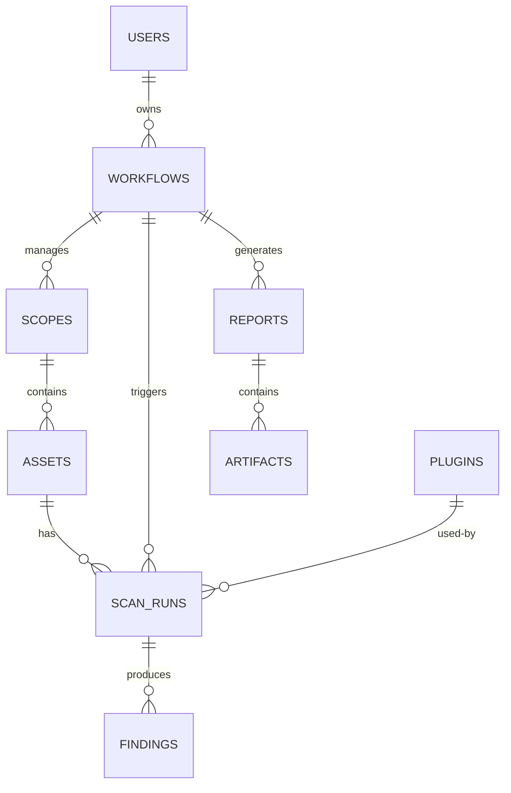

# Database Design

This document defines the logical data model and PostgreSQL schema for AegisX. It assumes the system architecture in `Docs/03_Architecture.md` and the MVP constraints in `Docs/10_MVP.md`.

## Goals

- Durable, auditable storage of assets, scan runs, findings, workflows, and plugins.  
- Support efficient queries for reporting, correlation, and operator workflows.  
- Allow safe evolution via a migration strategy that supports zero-downtime patterns where possible.

## ER Diagram (Mermaid)



## Conceptual model (entities)

- users: operator accounts and API clients. Includes soft-delete capabilities.
- workflows: definitions and runtime state for long-running pipelines.  
- scopes: canonical target scopes (domains, CIDR ranges, asset groups). Includes soft-delete capabilities.
- assets: discovered hosts, domains, IPs with metadata. Use `inet` for IPs when relevant. Includes soft-delete capabilities.
- scan_runs: executions of scanners (discovery, port-scan, httpx, nuclei).  
- findings: normalized vulnerability/issue records linked to assets and scan runs.  
- plugins: registered plugins and capability metadata. Uses lifecycle states (draft, approved, disabled, deprecated) and includes soft-delete capabilities.
- reports: generated report metadata.
- artifacts: stored binary artifacts and raw tool outputs (stored in object store; metadata in DB).
- audit_logs: captures system and user actions for full auditability.
- workflow_events: detailed lifecycle and debugging events for workflows.
- plugin_events: operational logs and state changes for plugins.
- asset_relationships: tracks relationships between assets for Asset Intelligence.
- asset_history: tracks historical changes of assets for Asset Intelligence.
- correlated_findings: groups related findings together via the Correlation Service.
- risk_scores: stores risk analysis and scores for assets.

## PostgreSQL Schema (recommended)

Notes: prefer `UUID` primary keys (pgcrypto or uuid-ossp) for global uniqueness. Use `JSONB` for flexible metadata. Use `inet` for IPs. Soft deletion is supported using `deleted_at` and `deleted_by` fields for key entities.

```sql
-- Extensions (run once)
CREATE EXTENSION IF NOT EXISTS "uuid-ossp";
CREATE EXTENSION IF NOT EXISTS pgcrypto;
CREATE EXTENSION IF NOT EXISTS "pg_trgm"; -- optional for fuzzy search

-- Users
CREATE TABLE users (
  id uuid PRIMARY KEY DEFAULT gen_random_uuid(),
  username text UNIQUE NOT NULL,
  display_name text,
  email text UNIQUE,
  role text NOT NULL,
  created_at timestamptz NOT NULL DEFAULT now(),
  last_login timestamptz,
  deleted_at timestamptz,
  deleted_by uuid REFERENCES users(id) ON DELETE SET NULL
);

-- Scopes
CREATE TABLE scopes (
  id uuid PRIMARY KEY DEFAULT gen_random_uuid(),
  owner_id uuid REFERENCES users(id) ON DELETE SET NULL,
  name text NOT NULL,
  type text NOT NULL, -- domain, cidr, asset-group
  definition jsonb NOT NULL, -- canonical scope definition
  created_at timestamptz NOT NULL DEFAULT now(),
  deleted_at timestamptz,
  deleted_by uuid REFERENCES users(id) ON DELETE SET NULL,
  UNIQUE(owner_id, name)
);

-- Assets
CREATE TABLE assets (
  id uuid PRIMARY KEY DEFAULT gen_random_uuid(),
  scope_id uuid REFERENCES scopes(id) ON DELETE CASCADE,
  host text, -- hostname or domain
  ip inet,
  asset_type text, -- host, domain, ip
  metadata jsonb,
  first_seen timestamptz NOT NULL DEFAULT now(),
  last_seen timestamptz NOT NULL DEFAULT now(),
  fingerprint text, -- stable dedup key
  deleted_at timestamptz,
  deleted_by uuid REFERENCES users(id) ON DELETE SET NULL,
  UNIQUE(scope_id, fingerprint)
);

-- Workflows
CREATE TABLE workflows (
  id uuid PRIMARY KEY DEFAULT gen_random_uuid(),
  owner_id uuid REFERENCES users(id) ON DELETE SET NULL,
  name text NOT NULL,
  definition jsonb NOT NULL, -- workflow steps and config
  state text NOT NULL DEFAULT 'pending',
  created_at timestamptz NOT NULL DEFAULT now(),
  updated_at timestamptz NOT NULL DEFAULT now()
);

-- Plugins
CREATE TABLE plugins (
  id uuid PRIMARY KEY DEFAULT gen_random_uuid(),
  name text NOT NULL,
  version text NOT NULL,
  manifest jsonb NOT NULL,
  installed_at timestamptz NOT NULL DEFAULT now(),
  state text NOT NULL DEFAULT 'draft', -- draft, approved, disabled, deprecated
  deleted_at timestamptz,
  deleted_by uuid REFERENCES users(id) ON DELETE SET NULL
);

-- Scan runs
CREATE TABLE scan_runs (
  id uuid PRIMARY KEY DEFAULT gen_random_uuid(),
  workflow_id uuid REFERENCES workflows(id) ON DELETE SET NULL,
  scope_id uuid REFERENCES scopes(id) ON DELETE SET NULL,
  plugin_id uuid REFERENCES plugins(id) ON DELETE SET NULL,
  type text NOT NULL, -- discovery, port, http, nuclei
  status text NOT NULL DEFAULT 'pending',
  start_ts timestamptz,
  end_ts timestamptz,
  metrics jsonb,
  created_at timestamptz NOT NULL DEFAULT now()
);

-- Findings
CREATE TABLE findings (
  id uuid PRIMARY KEY DEFAULT gen_random_uuid(),
  asset_id uuid REFERENCES assets(id) ON DELETE CASCADE,
  scan_run_id uuid REFERENCES scan_runs(id) ON DELETE SET NULL,
  scanner text NOT NULL,
  severity text,
  title text,
  details jsonb,
  evidence jsonb,
  fingerprint text NOT NULL,
  created_at timestamptz NOT NULL DEFAULT now(),
  UNIQUE(fingerprint)
);

-- Reports
CREATE TABLE reports (
  id uuid PRIMARY KEY DEFAULT gen_random_uuid(),
  workflow_id uuid REFERENCES workflows(id) ON DELETE SET NULL,
  title text,
  format text NOT NULL, -- markdown, html, pdf
  storage_path text NOT NULL, -- pointer to object store
  created_at timestamptz NOT NULL DEFAULT now()
);

-- Artifacts (metadata only)
CREATE TABLE artifacts (
  id uuid PRIMARY KEY DEFAULT gen_random_uuid(),
  report_id uuid REFERENCES reports(id) ON DELETE CASCADE,
  scan_run_id uuid REFERENCES scan_runs(id) ON DELETE SET NULL,
  filename text,
  mime text,
  size_bytes bigint,
  storage_path text NOT NULL,
  created_at timestamptz NOT NULL DEFAULT now()
);

-- Audit Logs
CREATE TABLE audit_logs (
  id uuid PRIMARY KEY DEFAULT gen_random_uuid(),
  actor_id uuid REFERENCES users(id) ON DELETE SET NULL,
  action text NOT NULL,
  target_type text NOT NULL,
  target_id uuid NOT NULL,
  metadata jsonb,
  timestamp timestamptz NOT NULL DEFAULT now()
);

-- Workflow Events
CREATE TABLE workflow_events (
  id uuid PRIMARY KEY DEFAULT gen_random_uuid(),
  workflow_id uuid REFERENCES workflows(id) ON DELETE CASCADE,
  event_type text NOT NULL,
  payload jsonb,
  timestamp timestamptz NOT NULL DEFAULT now()
);

-- Plugin Events
CREATE TABLE plugin_events (
  id uuid PRIMARY KEY DEFAULT gen_random_uuid(),
  plugin_id uuid REFERENCES plugins(id) ON DELETE CASCADE,
  event_type text NOT NULL,
  payload jsonb,
  timestamp timestamptz NOT NULL DEFAULT now()
);

-- Asset Relationships
CREATE TABLE asset_relationships (
  id uuid PRIMARY KEY DEFAULT gen_random_uuid(),
  source_asset_id uuid REFERENCES assets(id) ON DELETE CASCADE,
  target_asset_id uuid REFERENCES assets(id) ON DELETE CASCADE,
  relationship_type text NOT NULL,
  metadata jsonb,
  created_at timestamptz NOT NULL DEFAULT now()
);

-- Asset History
CREATE TABLE asset_history (
  id uuid PRIMARY KEY DEFAULT gen_random_uuid(),
  asset_id uuid REFERENCES assets(id) ON DELETE CASCADE,
  change_type text NOT NULL,
  old_value jsonb,
  new_value jsonb,
  timestamp timestamptz NOT NULL DEFAULT now()
);

-- Correlated Findings
CREATE TABLE correlated_findings (
  id uuid PRIMARY KEY DEFAULT gen_random_uuid(),
  finding_id uuid REFERENCES findings(id) ON DELETE CASCADE,
  correlation_group text NOT NULL,
  confidence_score numeric(5,2),
  created_at timestamptz NOT NULL DEFAULT now()
);

-- Risk Scores
CREATE TABLE risk_scores (
  id uuid PRIMARY KEY DEFAULT gen_random_uuid(),
  asset_id uuid REFERENCES assets(id) ON DELETE CASCADE,
  score numeric(5,2) NOT NULL,
  severity text NOT NULL,
  explanation text,
  calculated_at timestamptz NOT NULL DEFAULT now()
);
```

## Relationships

- `users` 1 — * `workflows` (owner).  
- `workflows` 1 — * `scan_runs` (a workflow triggers runs).  
- `scopes` 1 — * `assets` (scope contains many assets).  
- `assets` 1 — * `findings` (an asset may have many findings).  
- `scan_runs` 1 — * `findings` (a scan run produces many findings).  
- `workflows` 1 — * `reports` (workflow generates reports).  

Foreign keys are defined to cascade or set null where appropriate to avoid orphaned heavy data (artifacts, assets) while preserving auditability for owners.

## Indexing Strategy

Principles:

- Optimize for read-heavy reporting and correlation queries.  
- Use specialized index types for JSONB, text search, and IP search.  
- Create targeted partial indexes for high-severity queries.
- Support soft-delete filtering in queries.

Suggested indexes:

```sql
-- Common lookups
CREATE INDEX idx_assets_scope_host ON assets(scope_id, host) WHERE deleted_at IS NULL;
CREATE INDEX idx_assets_scope_ip ON assets(scope_id, ip) WHERE deleted_at IS NULL;
CREATE INDEX idx_assets_fingerprint ON assets(fingerprint) WHERE deleted_at IS NULL;

CREATE INDEX idx_scanruns_workflow ON scan_runs(workflow_id, status);
CREATE INDEX idx_scanruns_scope ON scan_runs(scope_id, created_at);

-- Findings: search and severity
CREATE INDEX idx_findings_asset ON findings(asset_id);
CREATE INDEX idx_findings_fingerprint ON findings(fingerprint);
CREATE INDEX idx_findings_created ON findings(created_at);
CREATE INDEX idx_findings_severity ON findings(severity);

-- JSONB indexes for metadata-heavy queries
CREATE INDEX idx_assets_metadata_gin ON assets USING GIN (metadata jsonb_path_ops);
CREATE INDEX idx_scanruns_metrics_gin ON scan_runs USING GIN (metrics);
CREATE INDEX idx_findings_details_gin ON findings USING GIN (details);

-- Full-text search on finding title/details (optional)
CREATE INDEX idx_findings_ft ON findings USING GIN (to_tsvector('english', coalesce(title,'') || ' ' || coalesce(details->> 'text','')));

-- Partial index for critical/high severity findings for fast retrieval
CREATE INDEX idx_findings_critical ON findings(created_at) WHERE severity IN ('critical','high');

-- Trigram for fuzzy host/domain search
CREATE INDEX idx_assets_host_trgm ON assets USING GIN (host gin_trgm_ops);

-- Audit and Intelligence lookups
CREATE INDEX idx_audit_logs_target ON audit_logs(target_type, target_id);
CREATE INDEX idx_asset_relationships_source ON asset_relationships(source_asset_id);
CREATE INDEX idx_asset_relationships_target ON asset_relationships(target_asset_id);
CREATE INDEX idx_correlated_findings_group ON correlated_findings(correlation_group);
CREATE INDEX idx_risk_scores_asset ON risk_scores(asset_id, calculated_at DESC);
```

Notes on index creation:

- For large tables in production, create indexes concurrently (`CREATE INDEX CONCURRENTLY`) to avoid locking.  
- Monitor index bloat and usage; remove unused indexes to reduce write overhead.

## Partitioning and Archival

- If findings/scan_runs grow large, partition by time (monthly/quarterly) or by scope/customer.  
- Use partitioned tables for `findings` and `scan_runs` with retention policies that move older partitions to cheaper storage or drop after policy period.

## Migration Strategy

Tools and approach:

- Use a versioned migration tool (recommended: Alembic for Python, Flyway or Sqitch for SQL-first workflows).  
- Keep migrations in source control and review them in PRs.  
- Each migration must include an `up` and `down` (or rollback) path when possible.

Zero-downtime migration patterns:

1. Expand-then-contract pattern:
   - Add new nullable columns or new tables (expand phase).  
   - Deploy application code to write both old and new fields.
   - Backfill data into new columns using background jobs.
   - Switch reads to new fields and then drop old columns (contract phase).

2. Index creation:
   - Create large indexes with `CREATE INDEX CONCURRENTLY` to avoid locks.  
   - For unique constraints on large tables, create a unique index concurrently and add the constraint after validation.

3. Column type changes:
   - Add a new column with the new type, backfill and validate, then swap usage.  

4. Data migrations and backfills:
   - Perform heavy backfills as background jobs with throttling and progress tracking; write idempotent jobs.

Operational steps for deploy-time migrations:

- Run schema checks in CI to validate migration scripts.  
- Apply non-blocking migrations during deployment (run concurrently where supported).  
- For breaking changes, schedule maintenance windows and notify users.  

Testing and verification:

- Unit tests for migration logic (where applicable).  
- Staging run of migrations on a recent production snapshot.  
- Schema compatibility tests to ensure older and newer application versions can work with schemas during a rollout.

## Backups and Retention

- Regular automated backups (daily full, frequent WAL shipping).  
- Test restore procedures quarterly.  
- Retention policy: findings and artifacts retention configurable per-customer; offload raw artifacts to object storage and retain metadata in DB subject to policy.

## Security and Access Controls

- Principle of least privilege for DB users: separate roles for application, read-only analytics, and admin.  
- Audit logging for sensitive tables (`findings`, `users`, `workflows`).  
- Encrypt backups and use network controls to restrict DB access.

## Next steps

- Review schema with backend and SRE teams.  
- Implement initial migration set and run in staging.  
- Add monitoring queries for slow indexes and table growth.

---
Prepared by the Database Architect for AegisX.
