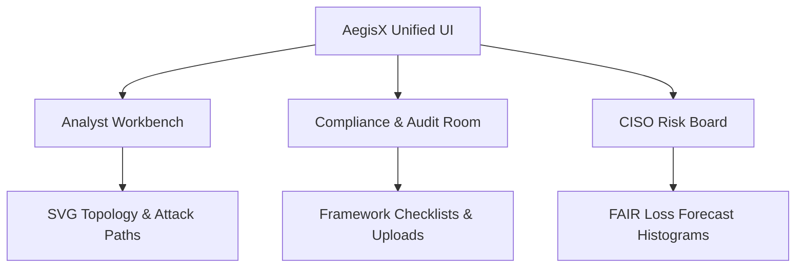
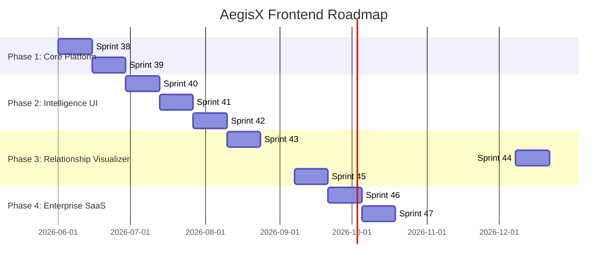

# AegisX Frontend Architecture & Roadmap Strategy

This document establishes the comprehensive, publication-grade frontend roadmap and architectural strategy for AegisX. It acts as a blueprint to transition AegisX from a raw API-driven intelligence engine into a production-ready, enterprise-grade Security Decision Support and Exposure management SaaS platform.

---

## Executive Summary

AegisX has achieved a high-performance backend, including advanced intelligence models, graph correlation databases, autonomous planning engines, and cache/lock abstractions. However, without a corresponding frontend, this intelligence remains decoupled from the end-user.

This strategy defines a multi-phase frontend roadmap beginning at **Sprint 38** and running through **Sprint 47**. By systematically implementing platform foundations, shared component systems, and dedicated workspaces tailored to five distinct user personas, this roadmap establishes the path to commercial readiness. 

Key pillars of this roadmap include:
- A unified design system leveraging Tailwind CSS v4.
- An interactive SVG/Canvas-based security relationship visualizer for graph and fabric nodes.
- Single-flight token refreshing and RouteGuard RBAC authorization.
- Real-time SSE/WebSocket streams for active SOC analyst queues.

---

## Product Maturity Assessment

| Dimension | Current Backend State (Sprint 37.5) | Current Frontend State (Pre-Sprint 38) | Gap Analysis |
| :--- | :--- | :--- | :--- |
| **Identity & RBAC** | SQLite/PostgreSQL roles mapped (`admin`, `operator`, `reader`). | Simple login views, no role-based UI route checking. | RouteGuard implementation required to intercept and isolate view layers. |
| **Context Scope** | Multi-tenant scope parameters isolated at SQL and route layer. | Header dropdown selections, local storage syncing. | Unified store synchronization and loading transitions. |
| **Resilience / SOC** | Scoring metrics and history logs calculated. | No visual representation of RTO/RPO or MTTR metrics. | Custom charting indicators and historical trend histograms needed. |
| **Risk / GRC** | Monte Carlo loss forecasts and ISO check mappings. | Read-only static pages. | FAIR probability charts, gap triage editors, and evidence loaders. |
| **Intelligence Graph** | Postgres CTE tables for nodes/edges. | Empty assets grid list. | Network topology maps, attack path overlays, and interactive SVGs. |
| **Autonomous Action** | Sequenced milestones and optimized schedules. | Standard lists with no prioritization mappings. | Roadmap Gantt timelines and drag-and-drop sequencing overrides. |

---

## Frontend Vision

The AegisX frontend is an **Interactive Decision Support Panel**. It does not merely present list logs; it provides analysts, architects, and CISOs with visual tradeoffs, predictive paths, and unified confidence flows.



---

## Information Architecture

### Navigation Hierarchy
- **Primary Sidebar**:
  - **Dashboard**: High-level overview (swaps views dynamically between Analyst, Manager, and CISO layouts).
  - **Recon & Workflows**: Active scope scans runner, scheduler, and plugin control panel.
  - **Asset Inventory**: Normalized hostnames, IP interfaces, and technology directories.
  - **Triage Center**: Active vulnerability findings and status overrides.
  - **Intelligence Graph**: Interactive network topology maps and relationship search.
  - **GRC Compliance**: Framework assessments, gaps checklist, and evidence audits.
  - **Decisions & Planning**: Recommendations queue, tradeoff charts, and autonomous milestones.
- **Topbar**:
  - Scope Context Selector (dropdown list syncing active workspace).
  - Notifications Center (SSE real-time pipeline events).
  - Profile & settings (RBAC display & logout control).

### Intelligence Hierarchy
- **Context Scope**: Any action or view is filtered by the globally selected `ScopeId`. Selecting a scope triggers unified cache refreshes across React Query hooks.
- **Triage Chain**: Raw findings map to Graph Nodes, which map to Risk Quantifications, which map to Decisions, which translate into Planning Milestones, ultimately adjusting the Unified Fabric confidence weights.

---

## Design System Strategy

### Design Tokens (Tailwind CSS v4 CSS Variables)

```css
:root {
  --color-zinc-950: #09090b;
  --color-zinc-900: #18181b;
  --color-zinc-800: #27272a;
  --color-zinc-400: #a1a1aa;
  
  --color-indigo-500: #6366f1;
  --color-indigo-600: #4f46e5;
  --color-indigo-950: #1e1b4b;
  
  --color-emerald-500: #10b981;
  --color-rose-500: #f43f5e;
  --color-amber-500: #f59e0b;
  
  --font-sans: 'Inter', sans-serif;
  --font-mono: 'JetBrains Mono', monospace;
}
```

### Component Guidelines
- **Card System**: Semi-transparent dark container (`bg-zinc-900/40 border border-zinc-800/60 backdrop-blur-md`). Hover actions apply slight scale expansions and glow accents (`hover:border-indigo-500/30 transition-all`).
- **Tables**: Minimal border alignments, absolute vertical line suppression, and dark zebra overlays (`odd:bg-zinc-900/10 even:bg-zinc-900/30`).
- **Drawers**: Fly-out sliding panels (`translate-x-0 transition-transform duration-300`) for quick inspection of vulnerabilities, playbooks, or node details without breaking the main dashboard focus.

---

## Sprint 38: Frontend Platform Foundation

### Sprint Objective
Deliver core authentication infrastructure, single-flight Axios token refresh mechanisms, global Zustand state storage, and role-based route access controls.

### User Personas
- **All Users**: Benefit from seamless session logins, authentication persistence, and consistent RBAC enforcement.

### Product Value
Establishes the security baseline and API network layer. Retries failed calls gracefully without causing UI flashing or lock collisions.

### Screens
- **Login Screen (`/login`)**: Secure inputs with custom state loaders and feedback logs.
- **Forbidden Error Screen (`/403`)**: Clean messaging indicating insufficient permissions and back-routing.

### Components
- **`RouteGuard`**: Layout wrapper intercepting router pushes.
- **`Loader`**: High-performance SVG spinner centering key interfaces.

### State Management
- **`useAuthStore` (Zustand)**: Controls `accessToken`, `refreshToken`, and parsed user profile metadata (`id`, `username`, `role`).
- **`useScopeStore` (Zustand)**: Maintains the globally active `selectedScopeId` parameter synced to `localStorage`.

### API Integrations
- `/api/v1/auth/login` (Post credential exchanges).
- `/api/v1/auth/refresh` (Direct token update request).

### UX & Accessibility
- Focus visible rings on input controls.
- Screen-reader-ready labels for authentication fields.

### Testing Requirements
- **Vitest**: Verify request header injection, mock token exchange execution, and RouteGuard routing redirections.

### Acceptance Criteria
- 100% of token refresh and route verification test metrics pass successfully in Vitest.

---

## Sprint 39: Shared UI Library & REST Integration

### Sprint Objective
Build the shared UI component framework and integrate MSW mocks to handle scopes onboarding, findings lists, and reports generation.

### User Personas
- **Security Analyst & GRC Analyst**: Benefit from reusable components, tables, and dialog confirm prompts.

### Screens
- **Scopes Dashboard (`/scopes`)**: Target definition lists with CRUD popups.
- **Findings Inventory (`/findings`)**: Paginated tables listing asset exposures.
- **Scan Workflows Hub (`/workflows`)**: Active celery task progress cards.

### Components
- **`StatusBadge`**: Translates status states (`active`, `fused`, `compliant`) to color mappings.
- **`DataTable`**: Features built-in pagination, sorting column headers, and select rows.
- **`ConfirmDialog`**: Confirm actions with built-in `Escape` keyboard listeners.

### State Management
- **`useScopes` / `useFindings` (React Query)**: Manages lists cache keys. Cache invalidation occurs automatically when the active Zustand scope shifts.

### API Integrations
- `/api/v1/scopes` (GET list, POST create).
- `/api/v1/findings` (GET list, PUT status update).
- `/api/v1/workflows` (POST scan triggers).

### UX & Accessibility
- Accessible modal role parameters (`role="dialog"`) with aria-describedby bindings.
- Custom skeleton loaders for data tables.

### Testing Requirements
- **Vitest & MSW**: Validate list fetches, mock search input changes, and click events for confirm actions.

### Acceptance Criteria
- All 16 base vitest mocks pass, verifying scope listing, scan executions, and csv report exports.

---

## Sprint 40: Cyber Resilience & SOC Analytics Dashboard

### Sprint Objective
Expose real-time SOC Analyst work queues, MTTR timelines, and business unit cyber resilience RTO/RPO metrics.

### User Personas
- **SOC Manager**: Needs visibility into average resolution times and queue congestion.
- **Security Analyst**: Needs access to critical infrastructure backup states.

### Screens
- **Resilience Workbench (`/resilience`)**: Shows status of DR targets, backup configurations, and objective compliance scores.
- **SOC Performance Dashboard (`/soc-analytics`)**: Performance analytics displaying analyst scores, MTTR histograms, and team metrics.

### Components
- **`RecoveryCard`**: Detailed item view showing target objectives (RTO vs actual).
- **`QueueMetricWidget`**: Color-coded numbers displaying pending vs active threat hunts.
- **`MTTRChart`**: Inline SVG histogram plotting ticket closing distributions.

### State Management
- **`useResilience` / `useSOCAnalytics`**: Hooks retrieving cached records. Features manual refresh hooks to force background recalculation.

### API Integrations
- `/api/v1/cyber-resilience` (GET metrics, PUT transition).
- `/api/v1/soc-analytics` (GET metrics, GET performance).

### UX & Accessibility
- SVG charts scale dynamically using percentages to match screen resizing.
- Critical recovery parameters feature warning tooltips when targets are exceeded.

### Testing Requirements
- **Vitest**: Mock resilience transitions and verify MTTR values scale correctly.
- **Playwright**: E2E validation of status toggles on resilience records.

### Acceptance Criteria
- Resilience and SOC analytics dashboards render correctly inside scope boundaries.

---

## Sprint 41: FAIR Risk Modeling & GRC Checklist Explorer

### Sprint Objective
Implement FAIR quantitative risk distribution modeling (Loss Expectancy distributions) and GRC framework checklists showing audit readiness percentages.

### User Personas
- **CISO / Executive**: Evaluates financial loss ranges to align budgeting.
- **GRC Analyst**: Tracks compliance scores and uploads audit evidence.

### Screens
- **Risk Quantification Board (`/risk-quantification`)**: Shows min/max/mean annual loss expectancy projections.
- **GRC Compliance Panel (`/compliance`)**: Interactive grid lists showing control assessments, gaps checklists, and evidence panels.

### Components
- **`MonteCarloHistogram`**: SVG bar chart displaying probability distribution of loss.
- **`ControlChecklist`**: Accordion component displaying GRC requirements and status checks.
- **`EvidenceUploader`**: Drag-and-drop file target showing validation states.

### State Management
- **`useGRCStore`**: Controls pending evidence states, upload queue errors, and checklist expansion keys.

### API Integrations
- `/api/v1/cyber-risk-quantification` (GET loss metrics, GET forecasts).
- `/api/v1/governance-risk-compliance` (GET assessments, POST evidence).

### UX & Accessibility
- Drag-and-drop inputs support standard keyboard file selection.
- Screen readers announce GRC compliance score shifts dynamically.

### Testing Requirements
- **Vitest**: Verify Monte Carlo calculations format correctly.
- **Playwright**: Verify file selection and mock mock-upload progress indicators.

### Acceptance Criteria
- GRC evidence attachments map to the database and update compliance percentages dynamically.

---

## Sprint 42: Threat Intelligence Streams & Security Playbooks UI

### Sprint Objective
Deliver real-time threat intelligence streams (IOCs, Threat Actor profiles) and security knowledge base playbooks linked directly to vulnerabilities.

### User Personas
- **Security Analyst**: Needs access to indicator logs and mitigation steps.
- **Security Architect**: Standardizes playbook deployments.

### Screens
- **Threat Intel Center (`/threat-intelligence`)**: Stream list showing threat actors, indicators, and fusion scores.
- **Playbooks Library (`/knowledge-base`)**: Markdown playbook text repository.

### Components
- **`IndicatorStream`**: SSE list displaying new threat indicators dynamically.
- **`PlaybookViewer`**: Markdown renderer formatting mitigation playbooks.
- **`FusionIndicator`**: Interactive circle displaying confidence level of fused alerts.

### State Management
- **`useThreatIntel` / `useKnowledge`**: React Query caching. `useThreatIntel` subscribes to SSE channel endpoints on mount.

### API Integrations
- `/api/v1/threat-intelligence` (GET profiles, POST fuse).
- `/api/v1/security-knowledge` (GET playbooks, GET playbooks relationship).

### UX & Accessibility
- Real-time streams feature pause switches to prevent focus loss during triage.
- Markdown rendering matches the color system layout.

### Testing Requirements
- **Vitest**: Verify markdown playbooks render without errors.
- **Playwright**: Verify path navigation linking a playbook back to a threat.

### Acceptance Criteria
- SSE stream parses mock threat signals and appends them to the UI list within 200ms.

---

## Sprint 43: Security Intelligence Graph & Attack Path Visualizer

### Sprint Objective
Deliver an interactive, Postgres-backed relationship topology map displaying assets, findings, risks, and playbooks.

### User Personas
- **Security Architect**: Analyzes critical attack vectors and domain relationships.
- **Security Analyst**: Visualizes vulnerable assets.

### Screens
- **Intelligence Graph Canvas (`/intelligence-graph`)**: SVG node-link diagram with context controls.

### Components
- **`GraphCanvas`**: Custom SVG rendering nodes (Assets, Findings, Playbooks) and edges (dependencies, attack paths).
- **`NodeInspector`**: Slide-out drawer displaying details of the selected node.
- **`PathController`**: Search bar highlighting paths between source and target assets.

### State Management
- **`useGraphStore`**: Controls active zoom level, coordinate offsets, active selection filters, and search terms.

### API Integrations
- `/api/v1/security-intelligence-graph` (GET topology, GET path).

### UX & Accessibility
- Full keyboard panning support (`ArrowKeys` to pan, `+/-` to zoom).
- High-contrast visual modes distinguishing node categories.

### Testing Requirements
- **Vitest**: Verify graph node formatting and circular dependency checks.
- **Playwright**: Verify drag panning and click drawer events.

### Acceptance Criteria
- Topology visualizer renders 1,000+ nodes under 500ms using local memory adapter.

---

## Sprint 44: Decision Engine & Tradeoff Analytics UI

### Sprint Objective
Develop decision panels displaying remediation options alongside cost vs risk-reduction matrices.

### User Personas
- **SOC Manager**: Approves mitigations.
- **CISO**: Reviews cost/benefit metrics.

### Screens
- **Decisions Board (`/decisions`)**: Interactive queue of pending security actions.

### Components
- **`TradeoffScatterPlot`**: Plot mapping financial cost vs security confidence.
- **`AdvisoryWarning`**: Warning banner explaining LLM recommendations are advisory-only.
- **`TradeoffMatrix`**: Table overlay comparing decisions.

### State Management
- **`useDecisions`**: React Query handling decision state transitions (`committed`, `rejected`).

### API Integrations
- `/api/v1/security-decision` (GET decisions, PUT commit).

### UX & Accessibility
- Actions require double-click or confirmation popups to prevent accidental mutations.

### Testing Requirements
- **Vitest**: Verify tradeoff plot calculates coordinates correctly.
- **Playwright**: Verify decision confirmation triggers the backend API.

### Acceptance Criteria
- Committing a decision updates the status instantly, showing the advisory-only warning badge.

---

## Sprint 45: Autonomous Planning & Unified Fabric Routing UI

### Sprint Objective
Deliver interactive roadmaps for autonomous security plans and confidence weight routing tables for unified intelligence fabric nodes.

### User Personas
- **Security Architect**: Manages fabric configurations.
- **SOC Manager**: Monitors active remediation milestones.

### Screens
- **Autonomous Roadmaps (`/autonomous-planning`)**: Gantt timeline displaying milestones.
- **Intelligence Fabric Board (`/intelligence-fabric`)**: Interactive flow graph showing confidence values.

### Components
- **`GanttTimeline`**: Renders execution sequences and milestones (planned, active, closed).
- **`FabricFlowChart`**: Displays routing paths, weights, and decay factors.
- **`OptimizationControl`**: Button panel triggering sequencing updates.

### State Management
- **`usePlanning` / `useFabric`**: Syncs active milestones and fabric nodes.

### API Integrations
- `/api/v1/autonomous-security-planning` (GET plans, POST optimize).
- `/api/v1/unified-security-intelligence-fabric` (GET fabric, POST sync).

### UX & Accessibility
- Progress bars and status tags utilize high-contrast indicators.

### Testing Requirements
- **Vitest**: Verify Gantt chart calculations and fabric weight mapping.
- **Playwright**: E2E check on optimization triggers.

### Acceptance Criteria
- Triggering an optimization updates milestone positions and fabric flow values.

---

## Sprint 46: Enterprise Multi-Tenancy & SSO Integration

### Sprint Objective
Deliver enterprise workspaces, multi-tenant selector tools, and SAML/OIDC configuration panels.

### User Personas
- **CISO & Admin**: Manage multi-tenant configurations.

### Screens
- **Tenant Workspace Editor (`/admin/tenants`)**: Manage organizational units.
- **SSO Configurations Panel (`/admin/auth-settings`)**: Configure identity providers.

### Components
- **`WorkspaceSwitcher`**: Dropdown component in sidebar to switch environments.
- **`SSOConfigForm`**: Validates certificate uploads.

### State Management
- **`useTenantStore`**: Manages the active tenant context.

### API Integrations
- `/api/v1/admin/tenants` (GET list, POST create).
- `/api/v1/admin/auth-settings` (GET config, PUT update).

### UX & Accessibility
- Changing tenant context prompts the user to prevent unsaved changes.

### Testing Requirements
- **Vitest**: Verify tenant context switching resets the query cache.
- **Playwright**: Test the SSO toggle on the login page.

### Acceptance Criteria
- Switching tenant context updates the workspace instantly without leaking data.

---

## Sprint 47: Saved Investigations, Alerting & Report Builder

### Sprint Objective
Develop investigation boards, custom alerting rules builders, and drag-and-drop PDF report creators.

### User Personas
- **Security Analyst**: Saves active investigations.
- **CISO**: Builds custom dashboards and reports.

### Screens
- **Investigations Board (`/investigations`)**: Drag-and-drop whiteboard layout.
- **Alert Rules Editor (`/alerts/rules`)**: Conditional logic builder for notifications.
- **Report Builder (`/reports/builder`)**: Drag-and-drop PDF/HTML layout editor.

### Components
- **`QueryBuilder`**: Interface to build logic conditions.
- **`WidgetDropZone`**: Canvas element to drag and drop charting modules.
- **`InvestigationBoard`**: Kanban component to track finding investigations.

### State Management
- **`useInvestigationStore`**: Manages active whiteboard items, coordinate nodes, and saved layouts.

### API Integrations
- `/api/v1/investigations` (GET saved, POST create).
- `/api/v1/reports/custom` (POST generate).

### UX & Accessibility
- Dropzones support standard keyboard shortcuts.

### Testing Requirements
- **Vitest**: Verify custom report serialization structures.
- **Playwright**: Verify drag-and-drop whiteboard rendering.

### Acceptance Criteria
- Users can create, save, and export a custom report layout containing 3+ charts.

---

## Graph Visualization Strategy

Integrating the Postgres CTE backend graph relationships (Sprint 34) and Fabric confidence propagation routing (Sprint 37) in a responsive Next.js frontend requires a performant visualization layer.

```
┌────────────────────────────────────────────────────────┐
│                   Intelligence Graph                   │
├────────────────────────────────────────────────────────┤
│  [Scope Switcher]               [Depth Filter: 1 - 5]  │
│                                                        │
│   ┌────────┐          ┌────────┐          ┌────────┐   │
│   │ Asset  │─────────▶│ Vulner │─────────▶│Playbook│   │
│   │ Node   │          │  Node  │          │  Node  │   │
│   └────────┘          └────────┘          └────────┘   │
│       │                                                │
│       ▼                                                │
│   ┌────────┐                                           │
│   │Decision│                                           │
│   │  Node  │                                           │
│   └────────┘                                           │
└────────────────────────────────────────────────────────┘
```

### SVG vs Canvas Performance Tradeoffs
- **SVG Rendering**: Used for topologies containing under **500 nodes**. Provides crisp text rendering, built-in CSS hover states, and direct accessibility mapping.
- **Canvas Rendering**: Activated automatically for topologies exceeding **500 nodes** to optimize rendering speed.

### Node Exploration & Relationship Traversal
- Hovering over a node displays parent/child dependencies.
- Double-clicking a node centres the layout on it and fetches adjacent connections up to 3 levels deep.

### Attack Path Visualization
- Paths from public-facing assets to internal database resources are highlighted in red, with pulsating indicators showing step-by-step exploit risks.

---

## Dashboard Strategy

### 1. Analyst Dashboard
- **Focus**: Day-to-day triage and incident resolution.
- **Components**: Active finding feeds, critical vulnerability highlights, and active playbook recommendations.

### 2. SOC Manager Dashboard
- **Focus**: Team performance and queue management.
- **Components**: Queue status widgets, MTTR trend histograms, and analyst activity logs.

### 3. Executive / CISO Dashboard
- **Focus**: Risk profile and financial exposure.
- **Components**: Annualized Loss Expectancy meters, GRC audit readiness scores, and planning roadmap roadmaps.

---

## Real-Time Strategy

AegisX handles long-running recon workflows and threat hunts. Real-time updates prevent analysts from needing to refresh pages constantly.

| Scenario | Protocol | Data Frequency | Volume |
| :--- | :--- | :--- | :--- |
| **Workflow Run Progress** | **SSE (Server-Sent Events)** | Every 5-10 seconds | Low |
| **Active SOC Analyst Queue** | **WebSockets** | Sub-second updates | High |
| **Triage Status Modifications**| **REST with Query Invalidation**| User-triggered | Minimal |

---

## Reporting Strategy

The reporting dashboard exposes pre-built templates and generates clean documents.

### Layout Formats
- **Executive Summary PDF**: Includes high-level risk heatmaps, overall posture scores, and compliance meters.
- **Risk Quantification CSV/JSON**: Full Monte Carlo loss forecast exports.
- **GRC Compliance Report**: Full breakdown of ISO checklist results and evidence locations.

---

## Final Recommended Frontend Roadmap



### Estimated Total Development Effort
- **Total Duration**: 20 Weeks (10 Sprints of 2 weeks each).
- **Core Engineering Staff**: 2 Frontend Engineers, 1 UX/UI Designer, 1 QA Automation Engineer, 1 Product Manager.
- **Estimated Dev Hours**: **3,200 Engineering Hours**.

---

## Risks & Mitigations

### 1. Large Topology Graph Performance
- **Risk**: SVG lag on topologies containing 1,000+ nodes.
- **Mitigation**: Switch to Canvas rendering for large graphs, throttle pan/zoom events, and restrict initial loads to a depth filter of 2.

### 2. SSE Connection Management
- **Risk**: Connection limits exceeded in browser tabs.
- **Mitigation**: Share a single SSE client connection across tabs using `SharedWorker` or fall back to query polling.

---

## Long-Term Product Strategy

- **Self-Serve Report Builder**: Enable custom template drag-and-drop builders.
- **Evidence Management Locker**: Integrate encrypted S3 storage for audit documentation.
- **Collaborative Investigation Rooms**: Real-time collaborative war-rooms with shared whiteboard views and asset tracking.
