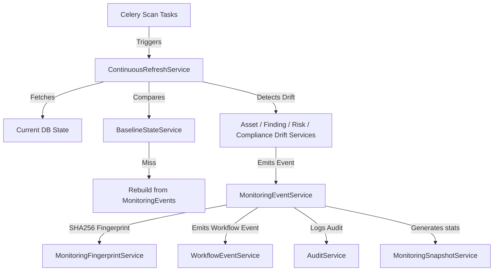

# Sprint 15 — Implementation Plan

> **Paste your implementation plan for Sprint 15 below this line.**
> Delete this placeholder text when adding your content.

# Sprint 15 Implementation Summary: Continuous Monitoring & Intelligence Refresh

Sprint 15 transforms AegisX into a **Continuous Monitoring & Posture Drift Intelligence Refresh Platform**. The monitoring layer is purely passive, read-only, and tracks state changes over time across assets, findings, risks, and compliance without mutating the underlying data models.

---

## 1. Continuous Monitoring Architecture

---

## 2. Hardening Feature #1: Monitoring Event Fingerprinting

To prevent event flooding and duplicate events during worker scan tasks or worker restarts, the `MonitoringFingerprintService` creates deterministic event hashes:
- **Fingerprint Formula**:
  `SHA256(change_type, asset_id, finding_id, previous_state, current_state)`
- If the generated fingerprint matches an existing event in the database/memory store, the creation request is deduplicated, and the existing event is returned.

---

## 3. Hardening Feature #2: Baseline State Service

Drift detection relies on comparing the current scan state against baseline snapshots rather than current state itself:
- **Baselines Caches**: Caches baseline states for assets, findings, risk scores, and governance status.
- **Dynamic Rebuild Rule**: Baselines are temporary caches. If a baseline is cleared or lost, it automatically reconstructs the exact state history by traversing past `MonitoringEvents` for the target asset/finding ID.

---

## 4. Drift Detection Engines

### A. Asset Drift Engine (`asset_drift_service.py`)
- Detects new assets (`ASSET_ADDED`), removed assets (`ASSET_REMOVED`), or modified assets (`ASSET_MODIFIED`) based on changes to hostname, IP, asset type, criticality, services, and technologies.

### B. Finding Drift Engine (`finding_drift_service.py`)
- Identifies new findings (`FINDING_ADDED`), resolved findings (`FINDING_RESOLVED`), or rediscovered findings (`FINDING_REDISCOVERED`), as well as changes to CVSS score and severity.

### C. Risk Drift Engine (`risk_drift_service.py`)
- Identifies risk score changes that cross threshold boundary conditions:
  - Increase >= `RISK_INCREASE_THRESHOLD` (15.0)
  - Decrease >= `RISK_DECREASE_THRESHOLD` (15.0)
  - Boundary crossing >= `CRITICAL_RISK_THRESHOLD` (75.0)

### D. Compliance Drift Engine (`compliance_drift_service.py`)
- Monitors posture state transitions:
  - Compliance failure (`COMPLIANCE_FAILED`)
  - Compliance restoration (`COMPLIANCE_RESTORED`)
  - Expiration of active risk acceptances (`RISK_ACCEPTANCE_EXPIRED`)

---

## 5. Caching & Snapshot Consistency

The `MonitoringSnapshotService` computes platform monitoring metrics:
- **Snapshot Statistics**: Totals for added assets, removed assets, added findings, resolved findings, risk increases, risk decreases, and governance changes.
- **Rebuild Consistency**: If the snapshot cache is lost, `get_snapshot()` traverses past monitoring events to reconstruct the metrics.

---

## 6. API Endpoints

All endpoints are read-only, check RBAC (admin/operator roles), enforce scope ownership, and wrap responses in `StandardResponse`:

| Method | Endpoint | Description |
| :--- | :--- | :--- |
| `GET` | `/api/v1/monitoring/events` | List all monitoring events (filtered by scope) |
| `GET` | `/api/v1/monitoring/assets/{id}` | Get events matching a specific asset |
| `GET` | `/api/v1/monitoring/findings/{id}`| Get events matching a specific finding |
| `GET` | `/api/v1/monitoring/summary` | Get summary counts of events |
| `GET` | `/api/v1/monitoring/drift/assets` | Get asset drift events |
| `GET` | `/api/v1/monitoring/drift/findings` | Get finding drift events |
| `GET` | `/api/v1/monitoring/drift/risk` | Get risk drift events |
| `GET` | `/api/v1/monitoring/drift/governance` | Get compliance & governance drift events |

