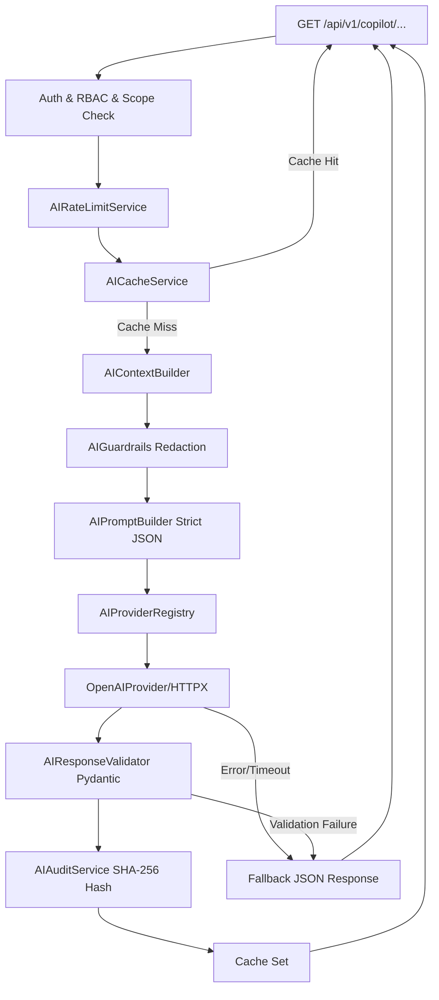

# Sprint 11 — Walkthrough

> **Paste your walkthrough for Sprint 11 below this line.**
> Delete this placeholder text when adding your content.

# Sprint 11: AI-Assisted Exposure Management Platform Walkthrough

AegisX has been transformed from a reporting platform into an AI-assisted exposure management platform by introducing an advisory AI Security Copilot layer.

---

## 1. Copilot Architecture

The AI Security Copilot layer operates as an advisory-only system. It consumes data from existing reports and services through a versioned Context Builder and redacts secrets before sending the data to the LLM via a registry-selected provider.



---

## 2. Core Service Layer & Security Guardrails

### A. AI Context Versioning & Safety Guardrails
- **`CONTEXT_VERSION = "1.0"`**: Introduced in [ai_context_builder.py](file:///c:/Users/Aditya/AegisX/backend/src/services/ai_context_builder.py). Standardizes structured context generation:
  - `build_asset_context`: Context for asset risk and details.
  - `build_finding_context`: Details of the finding and its matched evidence.
  - `build_executive_context`: Aggregates overall organization health metrics and trends.
- **`AIGuardrails`**: Implemented in [ai_guardrails.py](file:///c:/Users/Aditya/AegisX/backend/src/services/ai_guardrails.py). Recursively parses contexts to identify and redact sensitive keys (like passwords, keys, tokens, session cookies, and basic/bearer strings) to `[REDACTED]`.

### B. Strict JSON Mode & Response Validation
- **`AIPromptBuilder`**: Structured JSON schemas are injected in instructions, enforcing that LLM outputs contain **only** valid raw JSON without markdown code blocks (` ```json ` fences) or conversational prefixes/suffixes.
- **`AIResponseValidator`**: Parses and validates the LLM response against standard Pydantic schemas in [copilot_response_schema.py](file:///c:/Users/Aditya/AegisX/backend/src/domain/entities/copilot_response_schema.py):
  - `AssetExplanationSchema` (summary, risk_analysis, priority_reasons)
  - `FindingExplanationSchema` (summary, impact, priority, investigation_guidance)
  - `ExecutiveSummarySchema` (executive_summary, top_risks, notable_changes)
- **Failure Fallback Contract**: Copilot services gracefully intercept any validation exceptions, timeouts, or provider failures and return a standardized JSON fallback structure instead of crashing or returning HTTP 500 errors.

### C. Provider Registry & Auditing
- **`AIProviderRegistry`**: Resolves the configured provider dynamically using the environment configuration (`AI_PROVIDER`, defaults to `openai`).
- **`AIAuditService`**: Persists audit entries in the `audit_logs` database table. To protect sensitive data, it logs only SHA-256 hashes of the prompts and responses along with provider name and version metadata:
  ```json
  {
      "request_type": "explain_asset",
      "asset_id": "...",
      "finding_id": "...",
      "timestamp": "...",
      "prompt_hash": "...",
      "response_hash": "...",
      "provider": "openai",
      "provider_version": "gpt-4o-mini"
  }
  ```

### D. Compound Cache Key Versioning
- **`AICacheService`**: Extends TTL caching (1 hour) to use compound key structures including the active `CONTEXT_VERSION` and a hash of the generated prompt:
  - `(asset_id, context_version, prompt_hash)`
  - `(finding_id, context_version, prompt_hash)`
  - `("executive", context_version, prompt_hash)`
- **Cache Invalidation Hooks**: 
  - `ReportCacheService.invalidate_for_asset` cascades to evict asset and finding AI cache responses.
  - Celery task completion workflows in `worker.py` trigger AI cache invalidations after new scans refresh asset details or executive reports.

---

## 3. Presentation & API Layer

API routes are exposed in [copilot.py](file:///c:/Users/Aditya/AegisX/backend/src/api/v1/routers/copilot.py) under the prefix `/api/v1`:
- **Scope Verification**: Non-admin operators can only query assets/findings belonging to scopes they own.
- **RBAC Checks**: Block `reader` roles with HTTP 403 Forbidden; allow `admin` and `operator`.
- **Sliding-Window Rate Limits**: Limits operators to 250 requests/hour and administrators to 1000 requests/hour (handled by `AIRateLimitService`).

| Method | Endpoint | Return Model | Details / Rate Limits |
| :--- | :--- | :--- | :--- |
| **GET** | `/api/v1/copilot/assets/{id}` | `AssetExplanationResponse` | Explains asset risks and exposure |
| **GET** | `/api/v1/copilot/findings/{id}` | `FindingExplanationResponse` | Explains finding impact & remediation steps |
| **GET** | `/api/v1/copilot/executive` | `ExecutiveSummaryResponse` | High-level organizational posture analysis |

---

## 4. Verification Results

We verified all copilot behaviors and integration assertions in [test_copilot.py](file:///c:/Users/Aditya/AegisX/backend/tests/integration/test_copilot.py):

### Verified Scenarios:
1. **`test_safety_guardrails_redact_secrets`**: Ensures that sensitive tokens, keys, basic headers, and passwords inside the context are correctly replaced with `[REDACTED]`.
2. **`test_invalid_ai_response_rejected`**: Confirms that non-conforming structures or invalid JSON outputs trigger validation errors.
3. **`test_provider_registry_returns_openai_provider`**: Confirms the environment resolves to the correct default provider and model.
4. **`test_rate_limit_enforced`**: Ensures sliding-window boundaries restrict operators at 250 and admins at 1000 requests/hour.
5. **`test_cache_version_isolation`**: Confirms cached content cannot leak across different context versions.
6. **`test_context_version_present`**: Verifies context contains the correct versioning metadata.
7. **`test_api_explain_asset_admin_allowed` / `test_api_explain_asset_reader_blocked`**: Validates RBAC routing.
8. **`test_api_explain_finding_owner_check` / `test_api_explain_finding_unauthorized_scope_denied`**: Validates scope ownership restrictions.

### Full Test Suite Run (182 tests)
All 182 test cases passed successfully with zero mock warnings.

### Ruff & Black Verification
All newly added files are fully compliant with formatting rules and standard PEP 8 limits.


One Thing I Would Add Before Sprint 12

I would create:

ai_metrics_service.py

to track:

requests_total
cache_hits
cache_misses
provider_failures
validation_failures
fallback_responses
average_generation_time

No database table required yet.

A simple in-memory metrics service is enough.

Reason:

Once Sprint 12 introduces recommendations, you'll want visibility into:

how often AI is being used
cache effectiveness
provider reliability
fallback frequency

without retrofitting observability later.
