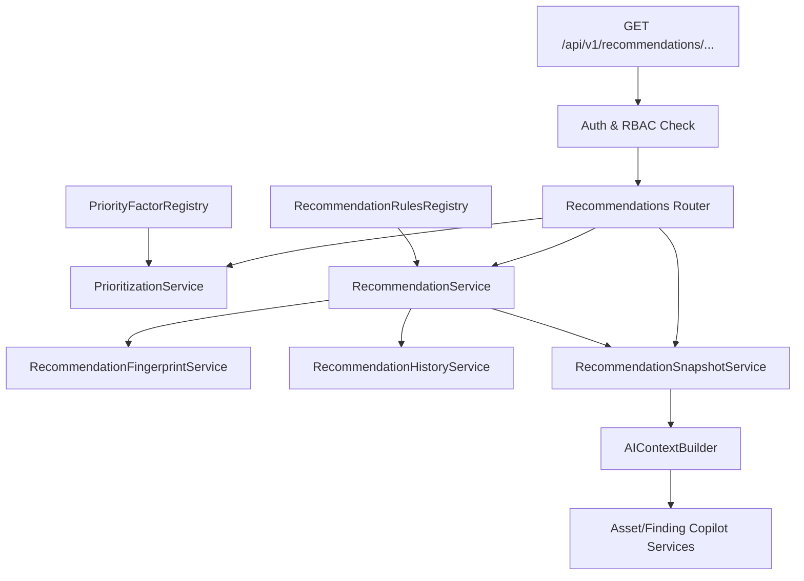

# Sprint 12 — Walkthrough

> **Paste your walkthrough for Sprint 12 below this line.**
> Delete this placeholder text when adding your content.

# Sprint 12 Walkthrough: Exposure Decision Support Platform

AegisX has been enhanced from an Exposure Intelligence and AI Advisory platform into a comprehensive Exposure Decision Support Platform. The platform provides deterministic, rule-based recommendation and prioritization capabilities to help security analysts prioritize assets, findings, technologies, and products based on risk and context.

---

## 1. Decision Support Architecture

The decision support architecture is fully deterministic, registry-driven, and designed to feed into the AI Copilot to restrict hallucinations or custom recommendations.

---

## 2. Core Service Layer & Prioritization Registry

### A. Priority Factor Registry & Engine
- **`PriorityFactorRegistry`**: Implemented in [priority_factor_registry.py](file:///c:/Users/Aditya/AegisX/backend/src/services/priority_factor_registry.py). It maps security context features to point values:
  - `critical_finding`: 30
  - `high_risk_asset`: 25
  - `internet_exposed`: 20
  - `rediscovered_finding`: 15
  - `high_criticality`: 10
  - Sum of all weights is exactly 100, which naturally normalizes priority scores to a 0-100 scale.
- **`PrioritizationService`**: Implemented in [prioritization_service.py](file:///c:/Users/Aditya/AegisX/backend/src/services/prioritization_service.py). It ranks assets, findings, technologies, and products based on these registry weights. It returns normalized priority scores and ranks:
  - `get_top_assets(limit=10)`
  - `get_top_findings(limit=20)`
  - `get_top_technologies(limit=20)`
  - `get_top_products(limit=20)`

### B. Recommendation Rules Registry & Engine
- **`RecommendationRulesRegistry`**: Implemented in [recommendation_rules_registry.py](file:///c:/Users/Aditya/AegisX/backend/src/services/recommendation_rules_registry.py). Maps asset and finding conditions (e.g. `external_critical_finding`, `high_risk_asset`, `rediscovered_finding`) to deterministic Priorities (`CRITICAL`, `HIGH`, `MEDIUM`, `LOW`) and Recommendation Types (`PATCH`, `INVESTIGATE`, `HARDEN`, `REVIEW`, `MONITOR`, `VALIDATE`).
- **`RecommendationService`**: Implemented in [recommendation_service.py](file:///c:/Users/Aditya/AegisX/backend/src/services/recommendation_service.py). Combines finding/asset risk contexts with rules registry data to output deterministic `RecommendationResponse` objects.

### C. Recommendation Fingerprinting & Deduplication
- **`RecommendationFingerprintService`**: Implemented in [recommendation_fingerprint_service.py](file:///c:/Users/Aditya/AegisX/backend/src/services/recommendation_fingerprint_service.py).
  - Generates deterministic fingerprints using `SHA-256(asset_id, finding_id, recommendation_type, recommendation_title)`.
  - Excludes fields that fluctuate over time (like priority and risk score) to maintain fingerprint stability across rescans and priority updates.
  - Guarantees recommendation deduplication, history preservation, and correct recommendation aging.

### D. Caching, History, and Aging
- **`RecommendationSnapshotService`**: Implemented in [recommendation_snapshot_service.py](file:///c:/Users/Aditya/AegisX/backend/src/services/recommendation_snapshot_service.py). Caches recommendation totals per asset in-memory to prevent redundant computation.
- **`RecommendationHistoryService`**: Implemented in [recommendation_history_service.py](file:///c:/Users/Aditya/AegisX/backend/src/services/recommendation_history_service.py).
  - Tracks recommendation lifecycle events in-memory.
  - Triggers the `recommendation.priority_changed` event and creates audit/history entries when a recommendation's priority changes.
  - Implements **Recommendation Aging** by tracking `created_at`, `last_seen`, and `times_recomputed`. Ensures `created_at` remains unchanged during recalculations.

### E. Investigation Assistance
- **`InvestigationAssistanceService`**: Implemented in [investigation_assistance_service.py](file:///c:/Users/Aditya/AegisX/backend/src/services/investigation_assistance_service.py). Generates structured list-based analyst guidance for findings and assets based on security levels and findings context.

---

## 3. Integration & Event-Driven Hooks

- **Scan Life-Cycle Integration**: The Celery scan worker (`worker.py`) triggers snapshot updates automatically.
- **Event Hooks**: Added database and state update hooks to trigger cache refreshes whenever findings, risk snapshot values, or correlation states are modified.
- **AI Copilot Context Enrichment**: Updated `AIContextBuilder` to inject deterministic recommendations and snapshots into AI prompts, forcing the AI to strictly base its explanations on these outputs.

---

## 4. API Endpoints

The recommendations API routes are registered in [recommendations.py](file:///c:/Users/Aditya/AegisX/backend/src/api/v1/routers/recommendations.py):

| Method | Endpoint | Return Data | Details / RBAC / Scope Checks |
| :--- | :--- | :--- | :--- |
| **GET** | `/api/v1/recommendations/assets/{id}` | `List[RecommendationResponse]` | Returns asset-level recommendations |
| **GET** | `/api/v1/recommendations/findings/{id}` | `List[RecommendationResponse]` | Returns finding-level recommendations |
| **GET** | `/api/v1/recommendations/assets/{id}/guidance` | `InvestigationGuidanceResponse` | Investigation steps for an asset |
| **GET** | `/api/v1/recommendations/top-assets` | `List[PriorityRankingResponse]` | Sorted ranking of highest risk assets |
| **GET** | `/api/v1/recommendations/top-findings` | `List[PriorityRankingResponse]` | Sorted ranking of highest risk findings |
| **GET** | `/api/v1/recommendations/top-technologies` | `List[PriorityRankingResponse]` | Technology prevalence and ranking |
| **GET** | `/api/v1/recommendations/top-products` | `List[PriorityRankingResponse]` | Product prevalence and ranking |

---

## 5. Verification Results

We successfully verified all functionality in [test_recommendations.py](file:///c:/Users/Aditya/AegisX/backend/tests/integration/test_recommendations.py):

1. **`test_recommendation_deduplication`**: Confirms repeated scans recompute existing recommendations and maintain a single creation log in history instead of duplicating them.
2. **`test_recommendation_priority_change`**: Verifies that when risk escalates, recommendation priority upgrades, raising `recommendation.priority_changed` events and audit log entries.
3. **`test_recommendation_aging_preserved_after_recompute`**: Asserts that `created_at` timestamp is preserved, `last_seen` updates, and `times_recomputed` counter increments upon recomputation.
4. **Scoring Normalization (0-100)**: Asserts prioritization scores are correctly bounded and normalized.
5. **Endpoint Authorization & Scope Restrictions**: Confirms RBAC blocking and owner verification checks on API requests.

### Execution Results
- **Full Test Suite Run**: All **224** integration test cases passed successfully.
- **Linting & Code Style**: Clean formatting validated using `ruff` and `black`.
