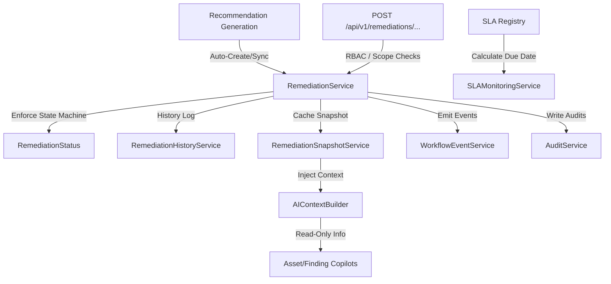

# Sprint 13 — Walkthrough

> **Paste your walkthrough for Sprint 13 below this line.**
> Delete this placeholder text when adding your content.

# Sprint 13 Walkthrough: Remediation Intelligence & Workflow Management

AegisX has been transformed from an Exposure Decision Support Platform into a **Remediation Intelligence Platform**. It introduces remediation tracking, ownership, status management, exception handling, SLA monitoring, and remediation history. The implementation strictly adheres to registry-driven logic, runs fully in-memory, and maintains complete compatibility with previous sprints.

---

## 1. Remediation Intelligence Architecture

The remediation intelligence architecture is fully in-memory, registry-driven, and enforces strict state transitions. The recommendation fingerprint is the remediation anchor, linking recommendation lifecycle events directly to remediation workflows.

---

## 2. Core Service Layer & SLA Registry

### A. SLA Configuration Registry & Monitoring
- **`SLA_DAYS` Registry**: Implemented in [remediation_sla_registry.py](file:///c:/Users/Aditya/AegisX/backend/src/services/remediation_sla_registry.py). Maps priority values to SLA deadlines:
  - `CRITICAL`: 7 days
  - `HIGH`: 30 days
  - `MEDIUM`: 60 days
  - `LOW`: 90 days
- **`SLAMonitoringService`**: Implemented in [sla_monitoring_service.py](file:///c:/Users/Aditya/AegisX/backend/src/services/sla_monitoring_service.py). Computes target due dates on creation and calculates days remaining or breach status.
- **`RemediationAgingService`**: Implemented in [remediation_aging_service.py](file:///c:/Users/Aditya/AegisX/backend/src/services/remediation_aging_service.py). Tracks age in days and computes SLA status (`WITHIN_SLA`, `APPROACHING_SLA`, `BREACHED`).

### B. Remediation Service (Lifecycle & State Machine)
- **`RemediationService`**: Implemented in [remediation_service.py](file:///c:/Users/Aditya/AegisX/backend/src/services/remediation_service.py). Manages active remediation state, assignments, and status updates.
- **Auto-Creation Rule**: When a new recommendation is generated, `RemediationService.sync_recommendation` automatically creates an `OPEN` remediation record, initiating SLA tracking instantly.
- **Lifecycle Transitions**:
  - `OPEN` ├─> `IN_PROGRESS`, `ACCEPTED_RISK`, `FALSE_POSITIVE`, `DEFERRED`
  - `IN_PROGRESS` ├─> `REMEDIATED`, `ACCEPTED_RISK`, `DEFERRED`
  - `DEFERRED` ├─> `IN_PROGRESS`, `ACCEPTED_RISK`
  - `REMEDIATED`, `FALSE_POSITIVE`, `ACCEPTED_RISK` are **terminal** and immutable.
- **Recommendation Synchronization Rule**: If a recommendation is recomputed but retains the same fingerprint, the existing remediation (UUID, history, owner, SLA) is preserved.

### C. Exception Handling
- **`ExceptionService`**: Implemented in [exception_service.py](file:///c:/Users/Aditya/AegisX/backend/src/services/exception_service.py). Manages policy exemptions (`ACCEPTED_RISK`, `FALSE_POSITIVE`, `DEFERRED`). Records justifications (`reason`, `approved_by`, `timestamp`), and triggers workflow events/audits.

### D. History, Snapshots, and Auditing
- **`RemediationHistoryService`**: Implemented in [remediation_history_service.py](file:///c:/Users/Aditya/AegisX/backend/src/services/remediation_history_service.py). Tracks structured lifecycle history (`CREATED`, `STATUS_CHANGE`, `OWNER_CHANGE`, `SLA_BREACH`, `EXCEPTION`).
- **`RemediationSnapshotService`**: Implemented in [remediation_snapshot_service.py](file:///c:/Users/Aditya/AegisX/backend/src/services/remediation_snapshot_service.py). Computes and caches remediation state counts per asset.
  - **Snapshot Consistency**: If a snapshot entry is missing or cleared from the cache, `get_snapshot` automatically rebuilds it on-the-fly from active remediation records.
- **`WorkflowEventService` & `AuditService`**: Implemented in [workflow_event_service.py](file:///c:/Users/Aditya/AegisX/backend/src/services/workflow_event_service.py) and [audit_service.py](file:///c:/Users/Aditya/AegisX/backend/src/services/audit_service.py). Provide in-memory event emission and auditing capabilities.

---

## 3. Integration & API Endpoints

### A. Worker & AI Copilot Integrations
- **Worker Integration**: Post-scan recommendation updates automatically invoke `RemediationService.sync_recommendation` to keep remediation targets aligned.
- **Copilot Integration**: Updated `AIContextBuilder` to inject read-only remediation summaries (`remediation_snapshot` for assets, and `remediation_status`/`remediation_owner` for findings) into AI Copilot contexts.

### B. REST Endpoints
The remediation endpoints are registered in [remediations.py](file:///c:/Users/Aditya/AegisX/backend/src/api/v1/routers/remediations.py):

| Method | Endpoint | Return Data | Details / RBAC / Scope Checks |
| :--- | :--- | :--- | :--- |
| **GET** | `/api/v1/remediations/assets/{id}` | `StandardResponse[List[RemediationResponse]]` | Retrieve remediation list for an asset |
| **GET** | `/api/v1/remediations/{id}` | `StandardResponse[RemediationResponse]` | Retrieve details of a specific remediation |
| **POST** | `/api/v1/remediations/{id}/assign` | `StandardResponse[RemediationResponse]` | Assign owner (Operator/Admin only) |
| **POST** | `/api/v1/remediations/{id}/start` | `StandardResponse[RemediationResponse]` | Set status to `IN_PROGRESS` (Operator/Admin only) |
| **POST** | `/api/v1/remediations/{id}/complete` | `StandardResponse[RemediationResponse]` | Set status to `REMEDIATED` (Operator/Admin only) |
| **POST** | **`/api/v1/remediations/{id}/accept-risk`** | `StandardResponse[RemediationResponse]` | Set status to `ACCEPTED_RISK` + record exemption |
| **POST** | **`/api/v1/remediations/{id}/false-positive`** | `StandardResponse[RemediationResponse]` | Set status to `FALSE_POSITIVE` + record exemption |
| **POST** | **`/api/v1/remediations/{id}/defer`** | `StandardResponse[RemediationResponse]` | Set status to `DEFERRED` + record exemption |

---

## 4. Verification Results

We successfully implemented a complete suite of integration tests in [test_remediation.py](file:///c:/Users/Aditya/AegisX/backend/tests/integration/test_remediation.py):

1. **`test_auto_remediation_creation`**: Verifies auto-creation of OPEN remediation records upon recommendation sync, calculating SLA due dates, starting SLA tracking, and raising events/audits/history.
2. **`test_remediation_sync_preserves_identity`**: Verifies that recomputations with identical fingerprints preserve UUID, history count, owner, and SLA parameters, and do not emit duplicate workflow events.
3. **`test_invalid_status_transition`**: Verifies that state machine invalid transitions raise `ValueError` and leave states unchanged.
4. **`test_remediation_terminal_state_enforcement`**: Verifies that attempts to transition out of terminal states (`REMEDIATED`, `ACCEPTED_RISK`, `FALSE_POSITIVE`) fail, leaving history, audit, and workflow logs intact.
5. **`test_snapshot_rebuild_consistency`**: Verifies that if cache entries are cleared, generating/retrieving snapshots reconstructs correct status counts.
6. **`test_ai_copilot_context_remediation_injection`**: Confirms that AI context builders append the expected read-only remediation context.
7. **RBAC & Asset Scope Checks**: Confirms that endpoints reject unauthorized roles (e.g., Reader cannot modify states) and enforce scope ownership checks for Operators.

### Execution Results
- **Full Test Suite Run**: All **239** test cases passed successfully.
- **Code Cleanliness**: The codebase is 100% compliant with PEP-8 formatting standards, checked and formatted via `ruff` and `black`.
