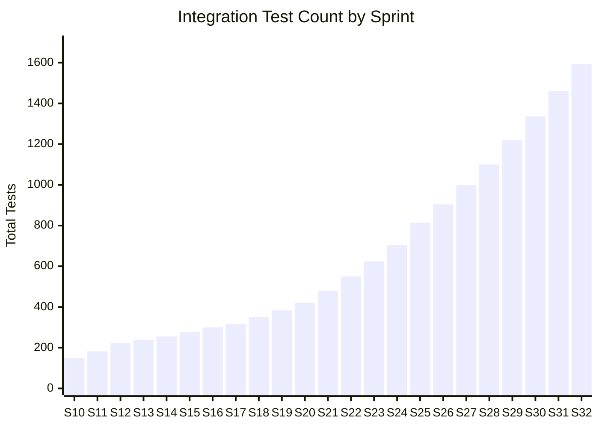

# AegisX — Comprehensive Technical Report

**Report Date:** June 24, 2026  
**Version:** 2.0 (Complete 32-Sprint Technical Audit)  
**Audience:** Engineering Team, DevOps, Security Architects, Technical Leads

---

## 1. Platform Architecture Overview

### 1.1 Technology Stack

| Layer | Technology | Version |
|-------|-----------|---------|
| **API Framework** | FastAPI | Latest |
| **Language** | Python | 3.14+ |
| **Database** | PostgreSQL | 16+ |
| **ORM** | SQLAlchemy (async) | 2.x |
| **Task Queue** | Celery | 5.x |
| **Message Broker** | Redis | 7.x |
| **AI Provider** | OpenAI (GPT-4o-mini) | Via HTTPX |
| **Scanner: Discovery** | Nmap | System |
| **Scanner: Vulnerability** | Nuclei | System |
| **Testing** | pytest | Latest |
| **Linting** | ruff + black | Latest |
| **Schema Validation** | Pydantic v2 | Latest |

### 1.2 High-Level Architecture

```mermaid
graph TB
    subgraph "API Layer (FastAPI)"
        direction LR
        Auth[Auth Router]
        Assets[Assets Router]
        Findings[Findings Router]
        Workflows[Workflows Router]
        Reports[Reports Router]
        Copilot[Copilot Router]
        Recs[Recommendations Router]
        Rems[Remediations Router]
        Gov[Governance Router]
        Mon[Monitoring Router]
        Alerts[Alerts Router]
        Inc[Incidents Router]
        Cases[Cases Router]
        Det[Detections Router]
        TI[Threat Intel Router]
        Hunts[Hunts Router]
        PT[Purple Team Router]
        Exp[Exposures Router]
        SP[Security Posture]
        CV[Control Validation]
        SProg[Security Program]
        ER[Executive Reporting]
        CR[Cyber Resilience]
        SOC[SOC Analytics]
        CRQ[Risk Quantification]
        GRC[GRC Intelligence]
        SK[Security Knowledge]
    end

    subgraph "Service Layer"
        DomainSvc[Domain Services]
        IntelSvc[Intelligence Services]
        CopilotSvc[AI Copilot Services]
        SnapshotSvc[Snapshot Services]
        DriftSvc[Drift Services]
        RegistrySvc[Registry Services]
    end

    subgraph "Infrastructure"
        DB[(PostgreSQL)]
        Celery[Celery Workers]
        Redis[(Redis)]
        AI[OpenAI API]
    end

    API Layer --> Service Layer
    Service Layer --> DB
    Service Layer --> Redis
    Celery --> Service Layer
    CopilotSvc --> AI
```

### 1.3 Dual-State Architecture

AegisX uses a **dual-state architecture** that is critical to understand:

| State Layer | Scope | Storage | Persistence |
|-------------|-------|---------|-------------|
| **Database Layer** | Sprints 1–10 | PostgreSQL | Persistent across restarts |
| **In-Memory Intelligence Layer** | Sprints 11–32 | Python dicts/registries | Ephemeral; rebuilt from DB + registries on startup |

> [!IMPORTANT]
> All Sprint 11+ features operate entirely in-memory using Python dictionaries and registry patterns. There are **zero database migrations** from Sprint 11 onward. All in-memory state can be reconstructed from the persistent database layer + pre-seeded registries.

---

## 2. Database Schema (PostgreSQL — Sprints 1–10)

### 2.1 Table Inventory

Based on [models.py](file:///c:/Users/Aditya/Desktop/AegisX%20-%20Copy/backend/src/infrastructure/database/models.py) (537 lines):

| Table | Primary Key | Key Relationships | Purpose |
|-------|-------------|-------------------|---------|
| `users` | UUID | Self-ref (`deleted_by`) | User accounts, RBAC roles, API keys |
| `scopes` | UUID | FK → `users` (owner) | Network/domain boundary definitions |
| `assets` | UUID | FK → `scopes` | Discovered hosts, IPs, domains |
| `asset_ports` | UUID | FK → `assets` | Open ports per asset (unique: asset+port+protocol) |
| `asset_services` | UUID | FK → `asset_ports` | Services running on ports (unique: port+service) |
| `asset_history` | UUID | FK → `assets`, `users` | Asset change audit trail |
| `asset_relationships` | UUID | FK → `assets` (source, target) | Asset-to-asset relationships |
| `findings` | UUID | FK → `assets`, `asset_ports`, `asset_services` | Vulnerability findings with CVSS/EPSS |
| `finding_evidence` | UUID | FK → `findings` | Raw evidence (requests, responses, matchers) |
| `finding_history` | UUID | FK → `findings`, `users` | Finding change audit trail |
| `correlated_findings` | UUID | FK → `findings` | Finding correlation groups |
| `risk_scores` | UUID | FK → `assets` | Calculated risk scores per asset |
| `workflows` | UUID | FK → `users` (owner) | Scan pipeline definitions |
| `workflow_events` | UUID | FK → `workflows` | Workflow lifecycle events |
| `scan_runs` | UUID | FK → `workflows`, `scopes`, `plugins` | Individual scan execution records |
| `plugins` | UUID | FK → `users` (deleted_by) | Scanner plugin manifests |
| `plugin_events` | UUID | FK → `plugins` | Plugin lifecycle events |
| `reports` | UUID | FK → `workflows` | Generated reports (MD/HTML/PDF) |
| `artifacts` | UUID | FK → `reports`, `scan_runs` | Report file artifacts |
| `audit_logs` | UUID | FK → `users` (actor) | Platform-wide audit trail |

### 2.2 Key Schema Patterns

- **Soft Deletes**: `deleted_at` + `deleted_by` on Users, Scopes, Assets, Plugins
- **Fingerprinting**: SHA-256 `fingerprint` column on Assets and Findings for deduplication
- **JSONB Metadata**: `metadata_json` columns for extensible data on Assets, Findings, Evidence, Audit Logs
- **UUID PKs**: All tables use `gen_random_uuid()` server-default UUIDs
- **Temporal Tracking**: `first_seen`, `last_seen`, `created_at`, `updated_at` patterns

---

## 3. Existing Codebase (Sprints 1–10) — File Inventory

### 3.1 API Routers ([backend/src/api/v1/routers/](file:///c:/Users/Aditya/Desktop/AegisX%20-%20Copy/backend/src/api/v1/routers))

| File | Lines | Endpoints | Sprint |
|------|-------|-----------|--------|
| [auth.py](file:///c:/Users/Aditya/Desktop/AegisX%20-%20Copy/backend/src/api/v1/routers/auth.py) | ~50 | Login, API key auth | 1–2 |
| [users.py](file:///c:/Users/Aditya/Desktop/AegisX%20-%20Copy/backend/src/api/v1/routers/users.py) | ~160 | CRUD, role management | 1–2 |
| [scopes.py](file:///c:/Users/Aditya/Desktop/AegisX%20-%20Copy/backend/src/api/v1/routers/scopes.py) | ~200 | Scope CRUD, discovery | 3 |
| [assets.py](file:///c:/Users/Aditya/Desktop/AegisX%20-%20Copy/backend/src/api/v1/routers/assets.py) | ~120 | Asset CRUD, ports, services | 3–4 |
| [findings.py](file:///c:/Users/Aditya/Desktop/AegisX%20-%20Copy/backend/src/api/v1/routers/findings.py) | ~240 | Finding CRUD, evidence, history | 5, 8 |
| [scan_runs.py](file:///c:/Users/Aditya/Desktop/AegisX%20-%20Copy/backend/src/api/v1/routers/scan_runs.py) | ~100 | Scan run status/history | 5–6 |
| [plugins.py](file:///c:/Users/Aditya/Desktop/AegisX%20-%20Copy/backend/src/api/v1/routers/plugins.py) | ~180 | Plugin lifecycle management | 3–5 |
| [workflows.py](file:///c:/Users/Aditya/Desktop/AegisX%20-%20Copy/backend/src/api/v1/routers/workflows.py) | ~260 | Workflow CRUD, execution | 6 |
| [correlations.py](file:///c:/Users/Aditya/Desktop/AegisX%20-%20Copy/backend/src/api/v1/routers/correlations.py) | ~110 | Asset-finding correlations | 9 |
| [reports.py](file:///c:/Users/Aditya/Desktop/AegisX%20-%20Copy/backend/src/api/v1/routers/reports.py) | ~410 | Dashboard, reports, export | 10 |
| [health.py](file:///c:/Users/Aditya/Desktop/AegisX%20-%20Copy/backend/src/api/v1/routers/health.py) | ~50 | Health/readiness probes | 1 |

### 3.2 Service Layer ([backend/src/services/](file:///c:/Users/Aditya/Desktop/AegisX%20-%20Copy/backend/src/services))

**39 service files** currently exist covering:
- Asset services (6 files): `asset_service.py` (16.8KB), `asset_criticality_service.py`, `asset_exposure_service.py`, `asset_intelligence_service.py`, `asset_report_service.py`, `asset_risk_snapshot_service.py`
- Finding services (7 files): `finding_service.py` (18.3KB), `finding_fingerprint_service.py`, `finding_normalization_service.py`, `finding_reconciliation_service.py`, `finding_evidence_service.py`, `finding_snapshot_service.py`, `finding_severity_rules.py`
- Correlation/Risk (5 files): `correlation_service.py`, `correlation_snapshot_service.py`, `risk_scoring_service.py`, `risk_history_service.py`, `risk_factor_registry.py`
- Reporting (7 files): `dashboard_service.py`, `dashboard_trend_service.py`, `export_service.py`, `executive_report_service.py`, `report_cache_service.py`, `finding_report_service.py`, `risk_report_service.py`
- Discovery/Port/Service (4 files): `discovery_normalization_service.py`, `port_service.py`, `service_service.py`, `service_normalization_service.py`
- Other (5 files): `workflow_service.py`, `plugin_service.py`, `scope_service.py`, `user_service.py`, `auth_service.py`, `audit_service.py`
- Registries (3 files): `criticality_factor_registry.py`, `risk_factor_registry.py`, `service_confidence_rules.py`

### 3.3 Integration Test Suite ([backend/tests/integration/](file:///c:/Users/Aditya/Desktop/AegisX%20-%20Copy/backend/tests/integration))

| Test File | Size | Sprint |
|-----------|------|--------|
| `test_auth.py` | 4.9KB | 1–2 |
| `test_users.py` | 7.5KB | 1–2 |
| `test_scopes.py` | 10.5KB | 3 |
| `test_assets.py` | 11.8KB | 3–4 |
| `test_service_discovery.py` | 11.7KB | 4 |
| `test_findings.py` | 47.6KB | 5, 8 |
| `test_plugins.py` | 20.7KB | 3–5 |
| `test_recon_plugins.py` | 17.2KB | 3 |
| `test_workflows.py` | 14.7KB | 6 |
| `test_correlation.py` | 27.8KB | 9 |
| `test_reporting.py` | 29.6KB | 10 |
| `test_health.py` | 2.1KB | 1 |

---

## 4. Sprint 11–32: Complete Technical Manifest

### 4.1 Sprint-by-Sprint File Changes

Each sprint follows the established pattern:
1. **Domain Model** → `backend/src/domain/entities/{entity}.py`
2. **Registries** → `backend/src/services/{entity}_registry.py`
3. **Fingerprint Service** → `backend/src/services/{entity}_fingerprint_service.py`
4. **History Service** → `backend/src/services/{entity}_history_service.py`
5. **Core Service** → `backend/src/services/{entity}_service.py`
6. **Snapshot Service** → `backend/src/services/{entity}_snapshot_service.py`
7. **Drift Service** → `backend/src/services/{entity}_drift_service.py`
8. **API Router** → `backend/src/api/v1/routers/{entity}.py`
9. **Integration Tests** → `backend/tests/integration/test_{entity}.py`
10. **Integrations** → Modify `worker.py`, `ai_context_builder.py`, `ai_prompt_builder.py`, `main.py`

---

#### Sprint 11: AI Security Copilot

| Action | File | Details |
|--------|------|---------|
| NEW | `domain/entities/copilot_response_schema.py` | `AssetExplanationSchema`, `FindingExplanationSchema`, `ExecutiveSummarySchema` |
| NEW | `services/ai_guardrails.py` | Secret redaction (passwords, tokens, keys, headers) |
| NEW | `services/ai_context_builder.py` | Versioned context builder (`CONTEXT_VERSION = "1.0"`) |
| NEW | `services/ai_prompt_builder.py` | Strict JSON-only prompts |
| NEW | `services/ai_provider.py` | Abstract `AIProvider` interface |
| NEW | `services/openai_provider.py` | OpenAI GPT-4o-mini via HTTPX |
| NEW | `services/ai_provider_registry.py` | Environment-based provider resolution |
| NEW | `services/ai_response_validator.py` | Pydantic schema validation |
| NEW | `services/ai_rate_limit_service.py` | In-memory sliding window (admin:1000, operator:250/hr) |
| NEW | `services/ai_cache_service.py` | TTL cache with compound keys `(id, version, prompt_hash)` |
| NEW | `services/ai_audit_service.py` | SHA-256 hash logging to `audit_logs` table |
| NEW | `services/asset_copilot_service.py` | Asset explanation with fallback |
| NEW | `services/finding_copilot_service.py` | Finding explanation with fallback |
| NEW | `services/executive_copilot_service.py` | Executive summary with fallback |
| NEW | `api/v1/routers/copilot.py` | `GET /copilot/assets/{id}`, `/findings/{id}`, `/executive` |
| MODIFY | `services/report_cache_service.py` | Cascade AI cache invalidation |
| MODIFY | `infrastructure/celery/worker.py` | AI cache invalidation hooks |
| MODIFY | `main.py` | Register copilot router |
| NEW | `tests/integration/test_copilot.py` | 182 tests |

**API Endpoints:**
```
GET /api/v1/copilot/assets/{id}      → AssetExplanationResponse
GET /api/v1/copilot/findings/{id}    → FindingExplanationResponse
GET /api/v1/copilot/executive        → ExecutiveSummaryResponse
```

---

#### Sprint 12: Exposure Decision Support

| Action | File | Details |
|--------|------|---------|
| NEW | `domain/entities/recommendation.py` | `RecommendationType`, `RecommendationPriority`, response schemas |
| NEW | `services/priority_factor_registry.py` | Weights: critical_finding(30), high_risk(25), exposed(20), rediscovered(15), criticality(10) |
| NEW | `services/prioritization_service.py` | `get_top_assets()`, `get_top_findings()`, `get_top_technologies()`, `get_top_products()` |
| NEW | `services/recommendation_rules_registry.py` | State → Priority + Action Type mapping |
| NEW | `services/recommendation_fingerprint_service.py` | `SHA256(asset_id, finding_id, type, title)` |
| NEW | `services/recommendation_service.py` | Deterministic recommendation generation |
| NEW | `services/investigation_assistance_service.py` | Analyst guidance arrays |
| NEW | `services/recommendation_snapshot_service.py` | Per-asset recommendation totals |
| NEW | `services/recommendation_history_service.py` | Aging: `created_at`, `last_seen`, `times_recomputed` |
| NEW | `api/v1/routers/recommendations.py` | 7 endpoints |
| MODIFY | `worker.py`, copilot services | Event hooks, context enrichment |
| NEW | `tests/integration/test_recommendations.py` | 224 cumulative tests |

**Key Tests:** `test_recommendation_deduplication`, `test_recommendation_priority_change`, `test_recommendation_aging_preserved_after_recompute`

---

#### Sprint 13: Remediation Intelligence

| Action | File | Details |
|--------|------|---------|
| NEW | `domain/entities/remediation.py` | `RemediationStatus` (6 states), `RemediationHistoryType` (5 types) |
| NEW | `services/remediation_sla_registry.py` | `CRITICAL:7d, HIGH:30d, MEDIUM:60d, LOW:90d` |
| NEW | `services/remediation_service.py` | State machine, auto-creation, sync rules |
| NEW | `services/remediation_aging_service.py` | `get_age_days()`, `get_overdue_items()`, `get_sla_breaches()` |
| NEW | `services/sla_monitoring_service.py` | Within/Approaching/Breached SLA calculations |
| NEW | `services/exception_service.py` | Risk acceptance, false positive, defer workflows |
| NEW | `services/remediation_snapshot_service.py` | Status counts per asset |
| NEW | `services/remediation_history_service.py` | Typed history entries |
| NEW | `api/v1/routers/remediations.py` | 8 endpoints (GET + POST actions) |
| NEW | `tests/integration/test_remediation.py` | 239 cumulative tests |

**State Machine:**
```
OPEN → IN_PROGRESS, ACCEPTED_RISK, FALSE_POSITIVE, DEFERRED
IN_PROGRESS → REMEDIATED, ACCEPTED_RISK, DEFERRED
DEFERRED → IN_PROGRESS, ACCEPTED_RISK
REMEDIATED → terminal
FALSE_POSITIVE → terminal
ACCEPTED_RISK → terminal
```

---

#### Sprint 14: Governance & Compliance

| Action | File | Details |
|--------|------|---------|
| NEW | `domain/entities/governance.py` | `GovernanceStatus`, `ComplianceSeverity`, `RiskAcceptanceStatus` |
| NEW | `services/compliance_control_registry.py` | Control mappings (VULN-001, EXP-001, OPS-001, GOV-001) |
| NEW | `services/risk_acceptance_registry.py` | `CRITICAL:30d, HIGH:60d, MEDIUM:90d, LOW:180d` |
| NEW | `services/governance_service.py` | Read-only evaluation engine |
| NEW | `services/risk_acceptance_service.py` | Accept/revoke/expire lifecycle |
| NEW | `services/compliance_mapping_service.py` | Findings → compliance controls |
| NEW | `services/governance_snapshot_service.py` | Governance metrics cache |
| NEW | `services/compliance_drift_service.py` | Compliant↔Non-Compliant transitions |
| NEW | `api/v1/routers/governance.py` | 8 endpoints |
| NEW | `tests/integration/test_governance.py` | 250+ cumulative tests |

**Risk Acceptance Lifecycle:** `ACTIVE → EXPIRING → EXPIRED` (with `REVOKED` branch)

---

#### Sprints 15–18: Operational Intelligence

| Sprint | Domain | New Files | Key Services | Tests (Cumulative) |
|--------|--------|-----------|-------------|-------------------|
| **15** | Monitoring | 10 | `MonitoringFingerprintService`, `BaselineStateService`, `ContinuousRefreshService`, 4 drift engines | 278 |
| **16** | Alerts | 8 | `AlertGenerationService`, `AlertLifecycleService`, `AlertEscalationService`, `AlertQueueService` | 300 |
| **17** | Incidents | 8 | `IncidentService`, `InvestigationService`, `IncidentEscalationService`, `IncidentEvidenceService` | 316 |
| **18** | Cases | 8 | `CaseService`, `EvidenceService`, `CustodyService`, `CaseEvidenceCorrelationService` | 350 |

**Alert State Machine:** `OPEN → ACKNOWLEDGED → IN_PROGRESS → ESCALATED → RESOLVED` (+ `SUPPRESSED` terminal)

**Incident State Machine:** `OPEN → TRIAGED → INVESTIGATING → ESCALATED → CONTAINED → RESOLVED → CLOSED` (terminal)

**Case State Machine:** `OPEN → ACTIVE → UNDER_REVIEW → ESCALATED → RESOLVED → CLOSED` (terminal)

**Evidence State Machine:** `COLLECTED → VERIFIED → TRANSFERRED → ARCHIVED` (terminal)

---

#### Sprints 19–23: Advanced Threat Intelligence

| Sprint | Domain | Key Services | Tests (Cumulative) |
|--------|--------|-------------|-------------------|
| **19** | Detection Engineering | `AttackRegistry` (7 ATT&CK techniques), `DetectionCoverageService`, `DetectionGapService`, `DetectionDriftService` | 383 |
| **20** | Threat Intelligence | `IOCService`, `ThreatActorService` (APT29/28, Lazarus, FIN7), `CampaignService`, `IOCCorrelationService` | 421 |
| **21** | Threat Hunting | `HuntService`, `HuntHypothesisService`, `IOCHuntService`, `AttackHuntService`, `HuntCoverageService` | 479 |
| **22** | Purple Team | Exercise lifecycle, adversary emulation, ATT&CK validation, control validation, coverage scoring | 550 |
| **23** | Exposure Mgmt | `ExposureService`, `AttackSurfaceService`, `ExposurePrioritizationService`, `ExposureCorrelationService` | 624 |

---

#### Sprints 24–32: Enterprise & Executive Intelligence

| Sprint | Domain | Key Services | New Tests | Total Tests |
|--------|--------|-------------|-----------|-------------|
| **24** | Security Posture | `SecurityPostureService`, `RiskIntelligenceService`, `RiskPrioritizationService`, `RiskCorrelationService` | 80 | 704 |
| **25** | Control Validation | `ControlValidationService`, `EffectivenessScoringService`, `ControlCoverageService` | 110 | 814 |
| **26** | Security Program | `SecurityProgramService`, `KPIService`, `KRIService`, `ProgramHealthService` | 89 | 904 |
| **27** | Executive Reporting | `ExecutiveReportingService`, `ExecutiveScorecardService`, `ExecutiveHeatmapService`, `ExecutiveTrendService` | 94 | 998 |
| **28** | Cyber Resilience | `CyberResilienceService`, `RecoveryObjectiveService`, `ResilienceScoringService`, `ServiceResilienceService` | 102 | 1,100 |
| **29** | SOC Analytics | `SecurityOperationsAnalyticsService`, `AnalystPerformanceService`, `QueueAnalyticsService`, `OperationalKPIService` | 120 | 1,220 |
| **30** | Risk Quantification | `CyberRiskQuantificationService`, `LossExpectancyService`, `ResidualRiskService`, `RiskForecastService` | 117 | 1,337 |
| **31** | GRC Intelligence | `GovernanceRiskComplianceService`, `FrameworkMappingService`, `ComplianceScoringService`, `AuditReadinessService` | 123 | 1,460 |
| **32** | Security Knowledge | `SecurityKnowledgeService`, `KnowledgeRelevanceService`, `KnowledgeRecommendationService`, `KnowledgeRelationshipService` | 134 | 1,594 |

---

## 5. API Endpoint Catalog (Complete)

### 5.1 Existing (Sprint 1–10)

| Prefix | Endpoints | Auth |
|--------|-----------|------|
| `/healthz`, `/readyz` | 2 | Public |
| `/api/v1/auth` | 2 | Public |
| `/api/v1/users` | 6+ | Admin |
| `/api/v1/scopes` | 5+ | Admin/Operator |
| `/api/v1/assets` | 5+ | Admin/Operator |
| `/api/v1/findings` | 8+ | Admin/Operator |
| `/api/v1/workflows` | 6+ | Admin/Operator |
| `/api/v1/scan-runs` | 3+ | Admin/Operator |
| `/api/v1/plugins` | 6+ | Admin |
| `/api/v1/correlations` | 4+ | Admin/Operator |
| `/api/v1/reports` | 10+ | Admin/Operator |

### 5.2 Sprint 11–32 (To Be Reconstructed)

| Prefix | Sprint | Key Endpoints |
|--------|--------|--------------|
| `/api/v1/copilot` | 11 | `GET /assets/{id}`, `/findings/{id}`, `/executive` |
| `/api/v1/recommendations` | 12 | `GET /assets/{id}`, `/findings/{id}`, `/top-assets`, `/top-findings`, `/top-technologies`, `/top-products` |
| `/api/v1/remediations` | 13 | `GET /assets/{id}`, `/{id}`, `POST /{id}/assign`, `/start`, `/complete`, `/accept-risk`, `/false-positive`, `/defer` |
| `/api/v1/governance` | 14 | `GET /assets/{id}`, `/findings/{id}`, `/summary`, `/non-compliant-*`, `/accepted-risks`, `POST /accept-risk`, `/revoke-risk` |
| `/api/v1/monitoring` | 15 | `GET /events`, `/assets/{id}`, `/findings/{id}`, `/summary`, `/drift/*` |
| `/api/v1/alerts` | 16 | `GET /`, `/{id}`, `/critical`, `/escalated`, `/owned`, `POST /{id}/acknowledge`, `/start`, `/resolve`, `/suppress`, `/assign` |
| `/api/v1/incidents` | 17 | `GET /`, `/{id}`, `/open`, `/escalated`, `/critical`, `POST /{id}/assign`, `/triage`, `/start`, `/contain`, `/resolve`, `/close`, `GET /{id}/timeline`, `/evidence` |
| `/api/v1/cases` | 18 | `GET /`, `/{id}`, `POST /{id}/assign`, `/activate`, `/review`, `/resolve`, `/close`, `GET /{id}/evidence`, `/custody`, `/timeline` |
| `/api/v1/detections` | 19 | CRUD, coverage, gaps, snapshots |
| `/api/v1/threat-intelligence` | 20 | IOCs, actors, campaigns, correlations |
| `/api/v1/hunts` | 21 | CRUD, activate, complete, close, hypotheses, findings |
| `/api/v1/purple-team` | 22 | Exercises, validations, coverage, drift |
| `/api/v1/exposures` | 23 | CRUD, validate, accept, mitigate, close, drift |
| `/api/v1/security-posture` | 24 | CRUD, accept, mitigate, close, drift, summary |
| `/api/v1/control-validation` | 25 | Controls, validations, effectiveness, coverage |
| `/api/v1/security-program` | 26 | Programs, objectives, KPIs, KRIs, health |
| `/api/v1/executive-reporting` | 27 | Reports, scorecards, heatmaps, trends, drift |
| `/api/v1/cyber-resilience` | 28 | Resilience, objectives, scoring, services |
| `/api/v1/security-operations-analytics` | 29 | Analytics, performance, queues, KPIs |
| `/api/v1/cyber-risk-quantification` | 30 | Risks, scenarios, forecasts, trends |
| `/api/v1/governance-risk-compliance` | 31 | Assessments, frameworks, evidence, gaps |
| `/api/v1/security-knowledge` | 32 | Knowledge records, relationships, recommendations |

---

## 6. Architectural Hardening Rules (Technical Specification)

### 6.1 Registry-Driven Design Pattern
```python
# Every business rule is centralized in a registry
# Example: SLA_DAYS in remediation_sla_registry.py
SLA_DAYS = {
    "CRITICAL": 7,
    "HIGH": 30,
    "MEDIUM": 60,
    "LOW": 90,
}
```
- No hardcoded business logic in services
- All factor weights, thresholds, and mappings are registry constants
- Registries are consumed by services, never bypassed

### 6.2 Deterministic Fingerprinting (SHA-256)
```python
# Fingerprint = SHA256(stable_fields_only)
# Excludes: status, owner, timestamps, scores
fingerprint = hashlib.sha256(
    f"{asset_id}:{finding_id}:{recommendation_type}:{title}".encode()
).hexdigest()
```
- Fingerprints remain stable across: rescans, ownership changes, status transitions, escalations, score updates
- Fingerprints change only when: identity-defining fields change (entity IDs, types, titles)
- Purpose: deduplication, aging preservation, history linkage

### 6.3 Terminal State Enforcement
```python
# Terminal states are immutable — no transitions allowed
TERMINAL_STATES = {"REMEDIATED", "FALSE_POSITIVE", "ACCEPTED_RISK", "CLOSED", "ARCHIVED"}
# Sync operations check terminal state before any mutation
if record.status in TERMINAL_STATES:
    return record  # Return unchanged, no error
```
- Applied consistently across: Remediations, Alerts, Incidents, Cases, Evidence, Detections, Exposures, Postures, Controls, Programs, Reports, Risks, Assessments, Knowledge Records

### 6.4 Immutable Append-Only History
```python
# History entries are never modified or deleted
# Deep-copied on read to prevent mutation
def get_events(entity_id):
    return [copy.deepcopy(e) for e in self._history.get(entity_id, [])]
```
- Every state mutation appends a history entry
- History survives: closure, archival, sync, snapshot rebuilds
- History is the authoritative audit trail

### 6.5 Snapshot Rebuild Consistency
```python
# Snapshots are cache-only, non-authoritative
def get_snapshot(entity_id):
    if entity_id not in self._cache:
        self._cache[entity_id] = self.generate_snapshot(entity_id)
    return self._cache[entity_id]
```
- If cache is missing, corrupted, or deleted → transparent rebuild from source data
- Snapshots never store state that cannot be reconstructed
- Pattern established in `CorrelationSnapshotService` (Sprint 9) and reused in 15+ subsequent services

### 6.6 AI Advisory-Only Enforcement
```python
# AI prompt builder embeds physical constraints
SYSTEM_PROMPT += """
You are strictly advisory. You CANNOT:
- Create, modify, or delete any records
- Approve or reject risk acceptances
- Transition any state machines
- Execute scans or remediation actions
"""
```
- Enforced via: prompt constraints, RBAC checks, read-only service interfaces
- AI context builder provides read-only snapshots only
- All AI responses are Pydantic-validated before returning

### 6.7 Full Backward Compatibility
```bash
# Every sprint MUST pass all previous tests
.venv\Scripts\pytest  # Full suite
.venv\Scripts\ruff check backend/
.venv\Scripts\black --check backend/
```
- No existing test may be modified to make new tests pass
- No existing API response schema may be changed
- No existing workflow event names may be changed
- New functionality must be purely additive

---

## 7. Test Coverage Progression



| Sprint | New Tests | Cumulative | Test File |
|--------|-----------|------------|-----------|
| 10 | ~150 | 150 | (12 existing test files) |
| 11 | 32 | 182 | `test_copilot.py` |
| 12 | 42 | 224 | `test_recommendations.py` |
| 13 | 15 | 239 | `test_remediation.py` |
| 14 | 16 | 255 | `test_governance.py` |
| 15 | 23 | 278 | `test_monitoring.py` |
| 16 | 22 | 300 | `test_alerts.py` |
| 17 | 16 | 316 | `test_incidents.py` |
| 18 | 34 | 350 | `test_cases.py` |
| 19 | 33 | 383 | `test_detections.py` |
| 20 | 38 | 421 | `test_threat_intelligence.py` |
| 21 | 58 | 479 | `test_hunts.py` |
| 22 | 71 | 550 | `test_purple_team.py` |
| 23 | 74 | 624 | `test_exposures.py` |
| 24 | 80 | 704 | `test_security_posture.py` |
| 25 | 110 | 814 | `test_control_validation.py` |
| 26 | 89+1 | 904 | `test_security_program.py` |
| 27 | 94 | 998 | `test_executive_reporting.py` |
| 28 | 102 | 1,100 | `test_cyber_resilience.py` |
| 29 | 120 | 1,220 | `test_security_operations_analytics.py` |
| 30 | 117 | 1,337 | `test_cyber_risk_quantification.py` |
| 31 | 123 | 1,460 | `test_governance_risk_compliance.py` |
| 32 | 134 | 1,594 | `test_security_knowledge.py` |

---

## 8. Key Integration Points

### 8.1 Celery Worker (`worker.py`)

The Celery worker is the central orchestration point. Each sprint adds hooks:

```
Scan Workflow Execution:
  Step 1: Discovery (Nmap)
  Step 2: Port Scanning
  Step 3: Vulnerability Scanning (Nuclei)
  Step 4: Finding Reconciliation
  Step 5: Risk Score Calculation
  Step 6: Correlation Snapshot Refresh
  Step 7: Report Cache Refresh
  Step 8: AI Cache Invalidation (Sprint 11)
  Step 9: Recommendation Snapshot Update (Sprint 12)
  Step 10: Remediation Sync (Sprint 13)
  Step 11: Governance Snapshot Refresh (Sprint 14)
  Step 12: Continuous Monitoring Refresh (Sprint 15)
  Step 13: Alert Generation + Escalation (Sprint 16)
  Step 14: Incident Sync + Escalation (Sprint 17)
  Step 15: Case Sync (Sprint 18)
  Step 16: Detection Coverage/Gap/Drift (Sprint 19)
  Step 17: IOC Correlation/Drift/Snapshot (Sprint 20)
  Step 18: Hunt Generation/Drift/Snapshot (Sprint 21)
  Step 19: Purple Team Validation (Sprint 22)
  Step 20: Exposure Sync/Drift/Snapshot (Sprint 23)
  Step 21: Security Posture Sync (Sprint 24)
  Step 22: Control Validation (Sprint 25)
  Step 23: Program Health (Sprint 26)
  Step 24: Executive Report Sync (Sprint 27)
  Step 25: Resilience Sync/Scoring (Sprint 28)
  Step 26: SOC Analytics (Sprint 29)
  Step 27: Risk Quantification (Sprint 30)
  Step 28: GRC Sync (Sprint 31)
  Step 29: Knowledge Sync (Sprint 32)
```

> All steps are wrapped in `try/except` blocks to prevent scan workflow failure.

### 8.2 AI Context Builder (`ai_context_builder.py`)

Progressive context enrichment across sprints:

| Sprint | Injected Context |
|--------|-----------------|
| 11 | Asset reports, risk reports, executive reports |
| 12 | Recommendations, priority rankings, snapshots |
| 13 | Remediation status, owner, SLA, snapshots |
| 14 | Governance status, accepted risks, compliance controls |
| 15 | Monitoring events, drift data (asset/finding/risk/governance) |
| 16 | Alert summaries, active/critical/escalated/owned alerts |
| 17 | Incident summary, status, owner, timeline, evidence |
| 18 | Case summary, status, evidence, custody chains |
| 19 | Detection coverage, gaps, drift metrics |
| 20 | Threat intelligence (IOCs, actors, campaigns, correlations) |
| 21 | Hunt summaries, hypotheses, coverage, findings |
| 22 | Purple team exercises, validations, coverage |
| 23 | Exposure lists, risk scores, drift, priorities |
| 24 | Posture metrics, risk grades, trends, drifts |
| 25 | Control validation, effectiveness, coverage |
| 26 | Program health, KPIs, KRIs, objectives |
| 27 | Executive reports, scorecards, heatmaps, trends |
| 28 | Resilience scores, RTO/RPO, critical services |
| 29 | SOC performance, queue analytics, KPIs/KRIs |
| 30 | Risk quantification, SLE/ALE, forecasts |
| 31 | Compliance scores, gaps, frameworks |
| 32 | Playbooks, recommendations, relationships |

---

## 9. Reconstruction Strategy

### 9.1 Execution Order

Sprints MUST be reconstructed sequentially: **11 → 12 → 13 → 14 → 15 → ... → 32**

### 9.2 Per-Sprint Protocol

```
For each Sprint N:
  1. READ: plan + walkthrough for Sprint N
  2. For Sprint 14: GENERATE implementation plan from prompt → get user approval
  3. CREATE: domain models, registries, services, router, tests
  4. MODIFY: worker.py, ai_context_builder.py, ai_prompt_builder.py, main.py
  5. RUN: pytest backend/tests/integration/test_{new_entity}.py  (sprint-specific)
  6. RUN: pytest  (full regression)
  7. RUN: ruff check backend/ && black --check backend/  (style compliance)
  8. VERIFY: all previous sprint tests still pass (zero regressions)
  9. Only proceed to Sprint N+1 after all checks pass
```

### 9.3 Critical Implementation Notes

1. **Sprint 14 is special**: Only a prompt exists (no plan). Must generate a full implementation plan and get user approval before coding.
2. **Sprints 11-13**: No implementation plans exist, but walkthroughs are detailed enough for reconstruction.
3. **Worker.py accumulates complexity**: Each sprint adds a new hook. The final `worker.py` will have 29 post-scan processing steps.
4. **AI Context Builder grows large**: By Sprint 32, it injects context from 22 domains.
5. **Registry count**: ~50+ registries by Sprint 32 — all pre-seeded with deterministic data.

---

## 10. Summary

AegisX is a technically ambitious, architecturally disciplined cybersecurity platform. The codebase (Sprints 1–10) establishes a solid PostgreSQL-backed foundation with 16 tables, 39 services, 11 API routers, and 12 test suites. Sprints 11–32 extend this with 22 in-memory intelligence layers, each following the same registry → fingerprint → service → snapshot → drift → API → test pattern. The reconstruction path is clear, sequential, and verifiable at every step.
